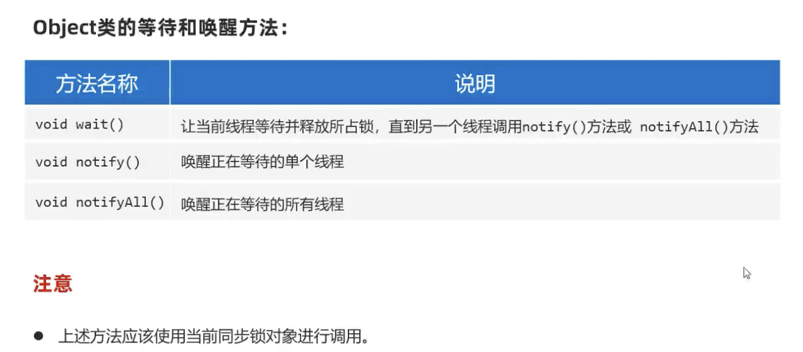
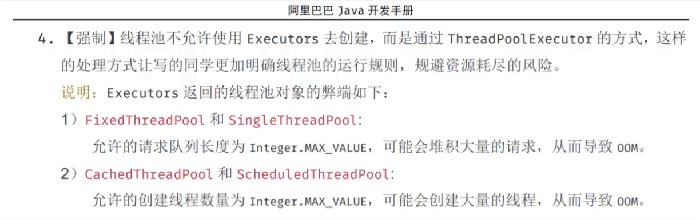
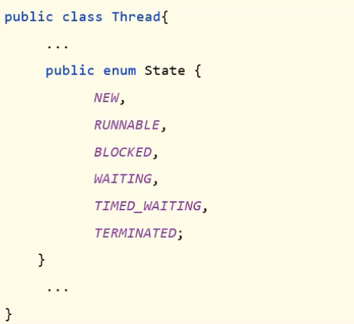

# Java

## 特殊文件读写

### Properties 
1. 都只能是键值对
2. 键不能重复
3. 文件后缀一般是.properties结尾的

如何读取？
使用继承map的Properties类读取

## 日志技术

## 多线程
* 线程：是一个程序内部的一条执行流程
* 程序中如果只有一条执行流程，就是单线程程序

多线程是指从软硬件上实现的多条执行流程的技术（多条线程由CPU负责调度执行）

* 如何在程序中创建多个线程？
  * java通过java.lang.Thread类的对象来代表线程
  
  多线程的创建方式：
  1. 继承Thread类
     1. 定义一个子类MyThread继承线程类java.lang.Thread，重写run()方法
     2. 创建MyThread类的对象
     3. 调用线程对象的start()方法启动线程(启动后还是执行run方法)
    优点： 编码简单
    缺点： 已经继承Thread，无法继承其他类，不利于功能扩展
        
 多线程的注意事项

     * 启动线程必须是调用start方法，不是调用run方法
     * 不要把主线程任务放在启动子线程之前
  2. 实现Runnable接口
     1. 定义一个线程任务类MyRunnable实现Runnable接口，重写run方法
     2. 创建MyRunnable任务对象
     3. 把MyRunnable任务对象交给Thread处理 new Thread(XX).start();
     4. 调用线程的start()方法启动线程
    优点： 任务类只是实现接口，可以继续继承其他类、实现其他接口、扩展性强
    缺点： 多一个Runnable对象
    也可以使用匿名内部类的写法
  3. 利用Callable接口、FutureTask类来实现
     1. 创建任务对象
      * 定义一个类实现Callable接口，重写call方法，封装要做的事和要返回的数据
      * 把Callable类型的对象封装成FurureTask（线程任务对象）
     2. 把线程任务对象交给Thread对象
     3. 调用Thread对象的start方法执行线程
     4. 线程执行完毕后，通过FutureTask对象的get方法去获取线程任务执行的结果
     优点： 线程任务类只是实现接口，可以继承类和实现接口，扩展性强，可以在线程执行完毕后去获取线程执行的结果
     缺点： 编码复杂一些
     

* 线程安全问题：
   * 存在多个线程同时执行
   * 同时访问一个共享资源
   * 存在修改该共享资源

* 线程同步：
  * 让多个线程实现先后依次访问共享资源
  * 常用方法：加锁，每次只允许一个线程加锁，加锁后才能进入访问，访问完毕后自动解锁，然后其他线程才能加锁进来
  * 加锁的常见方式：
     1. 同步代码块，把访问共享资源的核心代码上锁
        * 同步锁必须是同一把
        * 锁对象随便选择一个唯一的对象好不好？ 不好，会影响其他无关线程的执行
        * 锁对象的使用规范 建议使用共享资源作为锁对象，对于实例方法建议使用this作为锁对象，对于静态方法建议使用字节码(类名.class)对象作为锁对象 

     2. 同步方法，把访问共享资源的核心方法给上锁，以此保证线程安全
        在方法定义处加上synchronized关键字，其实就是实例方法用this锁，静态方法用类名.class锁
        
     3. Lock锁 
        它是jdk5提供的一个锁定操作，通过它可以创建出锁对象进行加锁和解锁， 

* 线程通信
   当多个线程共同操作共享的资源时，线程间通过某种方式互相告知自己的状态，以互相协调，并避免无效的资源争夺
   * 线程通信经典模型（生产者与消费者）
      * 生产者线程负责生产数据
      * 消费者线程负责消费生产者生产的数据
      * 注意：生产者生产完数据应该等待自己，通知消费者消费，消费者消费完数据也应该再通知生产者生产 
      
      this.wait(), this.notifyAll()
      
* 线程池
   是一个可以复用线程的技术
   不使用线程池的问题：
   * 用户每发起一个请求，后台就需要创建一个新线程来处理，下次新任务来了再创建新线程处理，但是**创建新线程的开销很大**，请求过多时，会严重影响系统性能

   如何创建线程池？
   * JDK5提供了代表线程池的接口：ExecutorService,常用的实现类是ThreadPoolExecutor
   
   如何得到线程池对象？
   * 方式一
      使用ThreadPoolExecutor创建

   * 方式二
      使用Executors(线程池的工具类)调用方法返回不同特点的线程池对象
      Executors使用可能存在的陷阱
      * 大型并发系统环境中使用Executors如果不注意可能会出现系统风险

      OOM：内存溢出异常

   线程池的注意事项：
   1. 临时线程什么时候创建？
      新任务提交时发现核心线程都在忙，任务队列也满了，并且还可以创建临时线程，此时才会创建临时线程
   2. 什么时候开始拒绝新任务？
      核心线程和临时线程都在忙，任务队列也满了，新任务过来的时候才会拒绝
    
   线程池处理Runnable任务
   execute()
   
   线程池处理Callable任务
   submit()

* 并发和并行
   进程：正在运行的程序就是一个独立的进程
   线程是属于进程的，一个进程中可以同时运行多个线程
   
   并发：CPU能同时处理的线程是有限的，为了保证全部线程都能往前执行，CPU会轮询为系统的每个线程服务
   并行：在同一时刻上，同时有多个线程在被CPU调度执行
   
   多线程如何执行？
   并发和并行同时存在
   
* 线程的生命周期
   Java为线程定义了6种状态

 
 
## 网络编程
 概念：可以让设备中的程序与网络上其他设备中的程序进行数据交互（实现网络通信）
 java.net.*包下提供了网络编程的解决方案！
 基本的通信架构：
 * CS
    Client客户端/Service服务端
 * BS
    Browser浏览器/Service服务端
 
 网络通信三要素：
 1. IP
   设备在网络中的地址
   全程“互联网协议地址”，是分配给上网设备的唯一标识

 2. 端口
   应用程序在设备中唯一的标识
   有16位，范围是0～65535
   * 分类
      * 周知端口：0～1023，被预先定义的知名应用占用HTTP占80端口，FTP占21
      * 注册端口：1024～49151，分配给用户进程或某些应用程序
      * 动态端口：49152～65535，动态分配
   自己开发的程序一般使用注册端口 

 3. 协议
   连接和数据在网络中传输的规则
   开放式网络互联标准：OSI网络参考模型（7层）
InetAddress
* 代表IP地址

UDP通信编程：
* 特点：无连接，不可靠
* 每次发出去就不管了
* java提供了java.net.DatagramSocket类来实现UDP通信

TCP通信编程“
* 特点：面向连接，可靠
* 通信双方会事先采用“三次握手”方式建立可靠连接
* Java提供java.net.Socket类实现TCP通信

UDP的服务端可以收多个客户端发来的消息，但TCP服务端不行，如果想支持多个客户端，必须使用多线程

架构
主线程：负责接收客户端连接
子线程：负责和某个客户端通信

## Java单元测试

单元测试：针对最小的功能单元，编写测试代码对其进行正确性测试
之前如何测试？
* 在main方法里编写测试代码，调用要测试的方法
* 无法实现自动化测试，一个方法测试失败，可能影响后面的方法
* 无法得到测试报告，需要程序员自己观察测试是否成功

Junit单元测试框架
* 可以用来对方法进行测试，由第三方公司开源，IDEA已集成
优点：
   * 可以灵活的编写测试代码，可以针对某个方法进行测试，也支持一键完成对所有方法进行测试，且各自独立
   * 不需要程序员去分析测试的结果，会自动生成测试报告出来
步骤：
1. 导入Junit,IDEA已集成
2. 为需要测试的业务类，定义对应的测试类，并为每个业务方法，编写对应的测试方法（公共，无参，无返回值）
3. 测试方法上必须声明@Test注解，然后在测试方法中，编写代码调用被测试的业务进行测试
4. 开始测试：选中测试方法，右键选择"JUnit运行"，如果通过测试则是绿色，否则是红色

## 反射

反射：加载类，并允许以编程的方式解剖类中的成分（成员变量，方法，构造器）
反射学什么？学习获取类的信息、操作它们
1. 加载类，获取类的字节码:class对象
2. 获取类的构造器:constructor对象
3. 获取类的成员变量:field对象
4. 获取类的成员方法:Method对象

获取类的构造器干什么？
创建实例
获取类的成员变量干什么？
取值赋值
获取类的成员方法干什么？
执行

反射的作用、应用场景
基本作用：得到一个类的全部成分然后操作
可以破坏封装性，直接访问private成员
适合做java框架

## 注解
是java代码中的特殊标记，作用是：让程序按注解信息来决定怎么执行

自定义注解
public @interface 注解名{
    public 属性类型 属性名() default 默认值;
}

注解本质是接口，所有的注解都继承了Annotation接口
@注解(),其实是一个实现类对象

元注解：修饰注解的注解
@Target：声明被修饰的注解只能在哪些位置用（类，接口，成员变量...）
@Retention:声明注解的保留周期（只在源码阶段存在，保留到字节码阶段，保留到运行阶段）

注解的解析：判断是否存在注解，存在还要把注解里的内容解析出来
用反射得到Class对象，判断有没有注解

## 动态代理
为什么需要代理？
对象如果嫌身上干的事太多，可以通过代理来转移部分指责
对象有什么方法想被代理，代理就要有对应的方法

 

