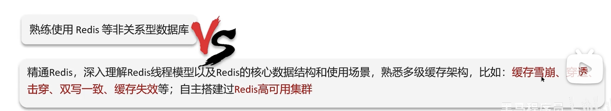

# Java面试

## 简历
应包含以下部分：
1. 基本信息
2. 教育背景
3. 求职意向
4. 工作经历
5. 职业技能
6. 项目经历
7. 个人优势
8. 个人荣誉

1～4在真实的前提下，可以适当美化
7～8不要夸张，关键在于难点、亮点

* 职业技能
放到简历的黄金位置
基本准则：写在简历上的必须能聊
职业技能=必要技术+其他技术 必要技术={springboot,ssm,redis,数据库}， 其他技术={微服务，ES，MQ,源码，高并发，jvm,技术选型，设计能力}（2～3个）

针对性的引导面试官

* 项目经历
项目个数以自己的工作经历为准，时间久的只写标题或不写
项目要体现业务深度或技术深度
有没有主导设计过**模块开发
尽可能展示指标数据（达到了多少QPS，达到了多少数据量）
