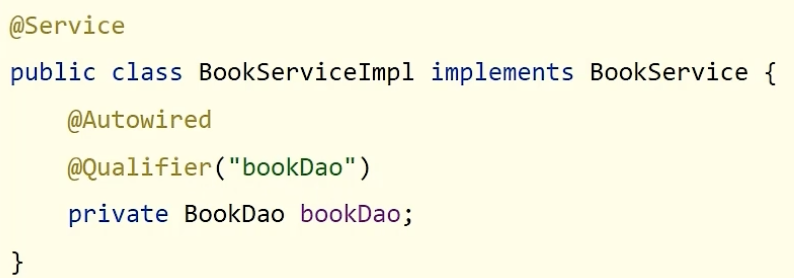
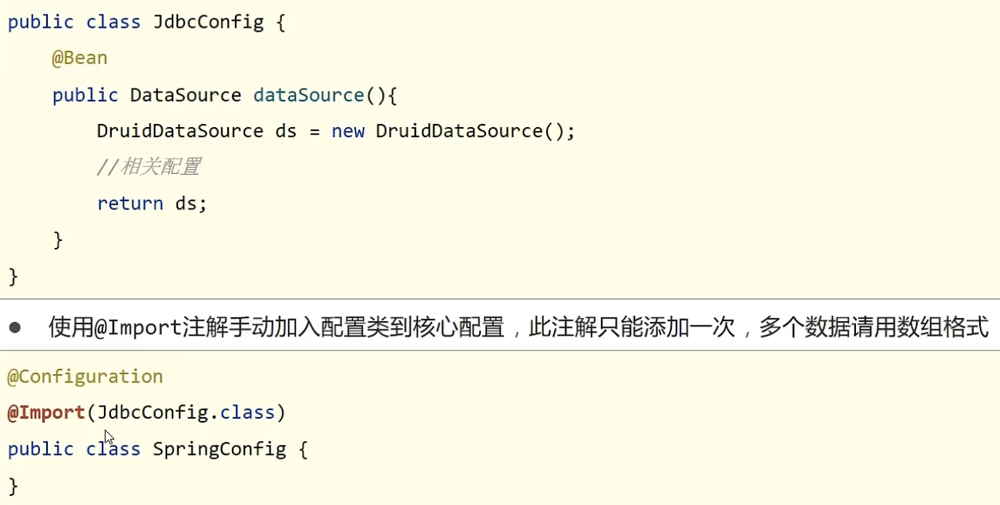
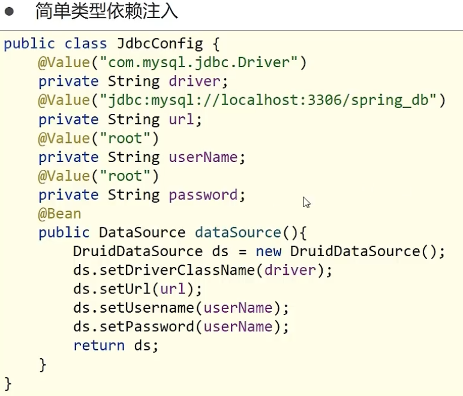
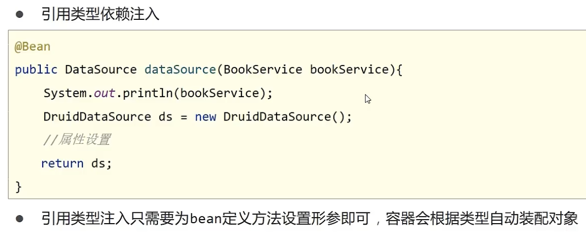
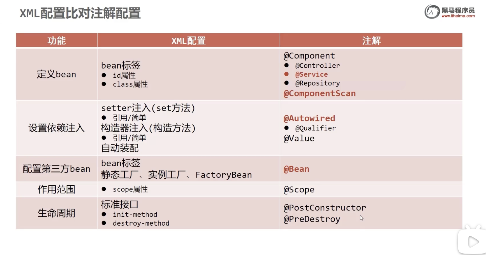
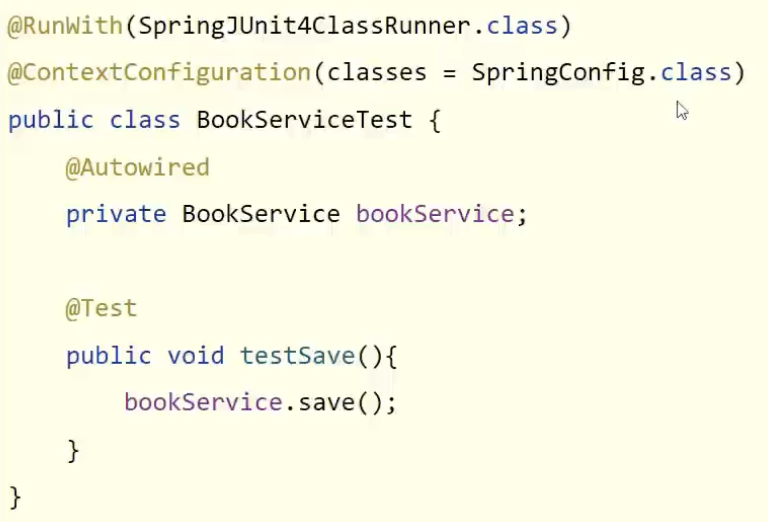
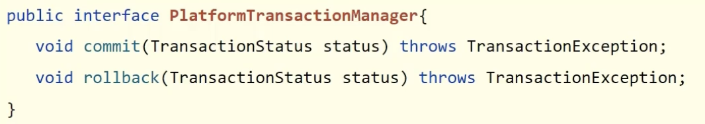

# Spring

## 架构

最核心部分：core container 核心容器，用来装对象

第二部分：AOP 面向切面编程  Aspects AOP思想实现

第三部分：Data Access 数据访问   

第四部分：Web

第五部分: Test

## 核心概念

- 代码书写现状
   - 耦合度高
- 解决方案
   - 使用对象时不通过new来产生对象，而是由外部提供对象
- IOC（控制反转）
   - 对象创建权转移到外部，即控制反转
- Spring的IOC实现
   - Spring提供了一个容器，成为IOC容器
   - IOC容器负责对象的创建、初始化等工作，被创建或被管理的对象在IOC容器中被称为**Bean**
- DI (依赖注入)
   - 在容器中建立bean与bean之间的依赖关系的过程，被称为**依赖注入**，有依赖关系就是：这个对象里用了那个对象，就依赖了
- 目标(充分解耦)
   - 使用IOC容器管理bean
   - 在IOC容器内将有依赖关系的bean进行关系绑定(DI)
- 效果
   - 使用对象时不仅可以从IOC容器中直接获取，并且获取到的bean已经绑定了所有依赖关系

## IOC案例

1. 管什么？  Service和Dao
2. 如何告诉IOC容器管哪些对象？  配置
3. 被管理的对象给IOC了，如何获得IOC容器?  接口
4. IOC容器得到后，如何获取bean?  接口方法
5. 使用Spring导入哪些坐标？ pom.xml

## DI案例

1. 基于IoC管理bean
2. Service中使用new形式创建的Dao对象是否保留？（否）
3. Service中需要的Dao对象如何进入到Service中？（提供方法）
4. Service与Dao间的关系如何描述？ （配置）

## bean

1. bean默认为单例，每次用的都是同一个对象
2. 适合交给容器管理的bean:表现层对象，业务层对象，数据层对象，工具对象
3. 不适合交给容器管理的bean:封装实体的域对象

### bean实例化

1. 使用构造方法 bean本质上是对象，创建bean使用无参构造方法完成
2. 使用静态工厂 
3. 使用实例工厂/ 使用bean工厂(FactoryBean)

### bean生命周期

- 初始化容器
   1. 创建对象（内存分配）
   2. 执行构造方法
   3. 执行属性注入（set操作）
   4. 执行bean初始化方法
- 使用bean
   1. 执行业务操作
- 关闭/销毁容器
   1. 执行bean销毁方法， 容器关闭前触发bean的销毁 ，关闭容器方式：手工关闭，注册关闭钩子

## 依赖注入

- 向一个类中传递数据的方式有几种？
   - 普通方法（set方法）
   - 构造方法 

- 依赖注入描述了在容器中建立bean与bean之间的依赖关系的过程，如果bean运行需要的是数字或字符串呢？
   - 引用类型
   - 简单类型（基本数据类型与String)

- 依赖注入方式
   - setter注入
      - 简单类型              
        在bean中定义引用类型属性并提供可访问的set方法，配置中使用property标签value属性注入简单类型数据
      - 引用类型
   - 构造器注入
      - 简单类型
      - 引用类型

- 依赖注入选择
  1. 强制依赖使用构造器注入，使用setter有概率不进行注入导致null对象出现
  2. 可选依赖使用setter注入进行，灵活性强
  3. Spring框架倡导使用构造器注入
  4. 有必要的话，可以一块用 
  5. 如果受控对象不提供setter方法，就必须使用构造器注入
  6. **自己开发的模块推荐使用setter注入**

## 依赖自动装配
- IoC容器根据bean所依赖的资源在容器中自动查找并注入到bean中的过程称为自动装配
- 自动装配方式
   - 按类型（常用）
   - 按名称
   - 按构造方法
   - 不启用自动装配 

- 自动装配只能用于引用类型依赖注入，不能用于简单类型
- 使用按类型装配时(byType)必须保障容器中相同类型的bean唯一
- 使用按名称装配时(byName)必须保障容器中具有指定名称的bean，因变量名与配置解耦合，不推荐使用
- 自动装配优先级低于setter注入和构造器注入，同时出现时，自动装配失效

## 容器

- 加载容器
   1. 加载类路径下的配置文件
   2. 从文件系统下加载配置文件 
- 获取bean
   1. 使用bean名称获取
   2. 使用bean名称获取并指定类型
   3. 使用bean类型获取

## 核心容器总结

### 容器相关

- BeanFactory是IoC容器的顶层接口，初始化BeanFactory对象时，加载的bean延迟加载
- ApplicationContext接口是Spring容器的核心接口，初始化时bean立即加载
- ApplicationContext接口提供基础的bean操作相关方法，通过其他接口扩展其功能
- ApplicationContext接口常用初始化类：ClassPathXmlApplicationContext

### bean相关

id: bean的id
name: bean的别名
class: bean类型，静态工厂类，FactoryBean类
scope: 控制bean的实例数量
autowire: 自动装配类型

### 依赖注入

构造器注入
setter注入

## 注解开发

### 注解开发定义bean
1. 使用@Component定义bean
2. 核心配置文件中通过组件扫描加载bean

- Spring提供@Component注解的三个衍生注解
   - @Controller 用于表现层bean定义
   - @Service 用于业务层bean定义
   - @Repository 用于数据层bean定义 
- 纯注解开发
   - @Configuration注解用于设定当前类为配置类
   - @ComponentScan注解用于设定扫描路径，此注解只能添加一次，多个数据young数组格式
   - 加载配置文件初始化容器变为加载配置类初始化容器
   - bean管理
      - bean作用范围 @Scope 单例singleton, 非单例prototype
      - bean生命周期 @PostConstruct生命周期开始时执行 @preDestroy生命周期结束时执行
   - 依赖注入 自动装配，没有构造器注入或setter注入
      - 使用@Autowired注解开启自动装配模式（按类型），可以不提供setter方法，但需要无参的构造方法
      - 使用@Qualifier注解开启指定名称装配bean

      - 使用@Value注解实现简单类型注入
   - 第三方bean管理
      - 使用@Bean配置第三方bean,一般使用独立的配置类管理第三方bean，可以使用导入式， 
      - 第三方bean依赖注入，简单类型用成员变量注入

      - 第三方bean依赖注入，引用类型注入

## Spring整合MyBatis

* SqlSessionFactoryBean
* MapperScannerConfigurer

## Spring整合JUnit

使用Spring整合JUnit专用的类加载器

## AOP简介

AOP概念：面向切面编程，一种编程范式
作用：在不惊动原始设计的基础上进行功能增强
Spring理念：无侵入式编程
核心概念：
  * 连接点(JoinPoint)：程序执行中的任意位置，粒度为执行方法、抛出异常、设置变量等
     * 在SpringAOP中指方法的执行 
  * 切入点(Pointcut):匹配连接点的式子
     * 在SpringAOP中，一个切入点可以只描述一个具体方法，也可以匹配多个方法
  * 通知(Advice):在切入点处执行的操作，也就是共性功能
     * 在SpringAOP中，功能最终以方法的形式呈现
  * 通知类：定义通知的类
  * 切面(Aspect):描述通知与切入点的对应关系 

AOP工作流程：
1. Spring容器启动
2. 读取所有切面配置中的切入点
3. 初始化bean，判定bean对应的类中的方法是否匹配到任意切入点
   * 匹配失败，创建对象
   * 匹配成功，创建原始对象（目标对象）的代理对象
4. 获取bean执行方法
   * 获取bean,调用方法并执行，完成操作
   * 获取的bean是代理对象时，根据代理对象的运行模式运行原始方法与增强内容

SpringAOP本质：代理模式
目标对象(Target):原始功能去掉共性功能对应的类产生的对象，这种对象是无法直接完成最终工作的
代理(Proxy):目标对象无法直接完成工作，需要对其进行功能回填，通过原始对象的代理对象实现

AOP切入点表达式：
* 切入点：要进行增强的方法
* 切入点表达式：要进行增强的方法的描述方式，可以描述接口，也可以描述实现类
* 切入点表达式标准格式：
   * 动作关键字：描述切入点的行为动作，例如execution表示执行到指定切入点
   * 访问修饰符：public, private，可以省略
   * 返回值
   * 包名
   * 类/接口名
   * 方法名
   * 参数
   * 异常名：方法定义中抛出指定异常，可以省略 
   * eg:
* 可以使用通配符描述切入点，快速描述
   * \*单个独立的任意符号，可以独立出现，也可以作为前缀或后缀的匹配符出现
   * ..匹配多个连续的任意符号，可以独立出现
   * +专用于匹配子类类型

AOP通知类型
* AOP通知描述了抽取的共性功能，根据共性功能抽取的位置不同，最终运行代码时要将其加入到合理的位置
* AOP通知类型：
   * 前置通知 @Before
   * 后置通知 @After
   * 环绕通知（重点）@Around
   * 返回后通知（了解）
   * 抛出异常后通知（了解）  

AOP通知获取数据
* 获取切入点方法的参数
   * JoinPoint:适用于前置、后置、返回后、抛出异常后通知，必须是方法的第一个形参
   * ProceedJointPoint:适用于环绕通知，必须是方法的第一个形参
* 获取切入点方法的返回值
   * 返回后通知
   * 环绕通知  
* 获取切入点方法运行异常信息
   * 抛出异常后通知
   * 环绕通知 

Spring事务简介
* 事务作用：在数据层保障一系列的数据库操作同成功同失败
* Spring事务作用：在数据层或业务层保障一系列的数据库操作同成功同失败

通过这个接口进行管理

# SpringMVC

## SpringMVC简介
SpringMVC技术与Servlet技术功能相同，均属于web层开发技术
* SpringMVC是一种基于java实现MVC模型的轻量级web框架
   * 优点：使用简单，开发便捷

controller加载控制与业务bean加载控制
* SpringMVC相关bean（表现层bean)
* Spring控制的bean
   * 业务bean(Service)
   * 功能bean(DataSource等)
因为功能不同，加载Spring控制的bean的时候要排除掉SpringMVC控制的bean

postman简介
作用：常用于接口测试

## 请求与响应

1. 团队多人开发，每人设置不同的请求路径，冲突问题如何解决？
    设置模块名作为请求路径前缀

请求方式
* GET请求 
* POST请求

请求参数
* 普通参数
  url地址传参，地址参数与形参变量名相同，定义形参即可接收参数，变量名不一样就加注解@RequestParam进行绑定
* POJO类型参数
   请求参数与形参对象属性名相同，定义POJO类型形参即可接收参数
* 嵌套POJO类型参数
  嵌套POJO参数：请求参数与形参对象属性名相同，按照对象层次结构关系即可接收嵌套POJO属性参数
* 数组类型参数
   数组参数：请求参数与形参对象名属性名相同且请求参数为多个，定义数组类型形参即可接收参数
* 集合类型参数
  集合保存不同参数：请求参数名与形参集合对象名相同且请求参数为多个，@RequestParam绑定参数关系
* json类型参数
  在postman里传json数据，body->raw->json
  接数据用@RequestBody
* 日期类型参数
  接收形参时，根据不同的日期格式设置不同的接收方式
  @DateTimeFormat(pattern = "yyyy-MM-dd") Date date1 

响应
* 响应页面
* 响应数据
  * 文本数据
  * json数据 
@ResponseBody注解把内容转成json返回给客户端

## REST风格

REST(Representational State Transfer),表现形式状态转换
* 传统风格资源描述形式
  http://localhost/users/getById?id=1
  http://localhost/users/saveUser
* REST风格描述形式
  http://localhost/users/1
  http://localhost/users
怎么区分干什么？
* 按照REST风格访问资源时使用行为动作区分对资源进行了何种操作
  * http://localhost/users 查询全部用户信息 GET(查询)
  * http://localhost/users/1 查询指定用户信息 GET(查询)
  * http://localhost/users 添加用户信息 POST(新增/保存)
  * http://localhost/usesr 修改用户信息 PUT(修改/更新)
  * http://localhost/users/1  删除用户信息 DELETE(删除）

根据REST风格进行资源访问就是RESTful

@RequestBody @RequestParam @PathVariable
* 区别
  * @RequestParam用于接收url地址传参或表单传参
  * @RequestBody用于接收json参数
  * @PathVariable用于接收路径参数，使用{参数名称}描述路径参数
* 应用
  * 发送请求参数超过1个时，以json为主，使用@RequestBody
  * 如果发送非json数据，用@RequestParam
  * 采用RESTful进行开发时，当参数数量较少，比如1个，使用@PathVariable接收请求路径变量，通常用于传递id值 

## SSM整合

## 拦截器
tomcat服务器拦截了所有请求，把请求划分为对静态资源(HTML,CSS,JS等)和对动态资源的，对动态资源的访问先过过滤器再进spring，再进spring的controller
* 拦截器是一种动态拦截方法调用的机制，在Springmvc中动态拦截控制器方法的执行
* 作用：在指定的方法调用前后执行预先设定的代码/阻止原方法执行

拦截器与过滤器的区别：
* 归属不同：Filter属于Servlet技术，Interceptor属于SpringMVC技术
* 拦截内容不同：Filter对所有访问进行增强，Interceptor仅对SpringMVC的访问进行增强

## 分模块开发
将原始模块按照功能拆分成若干子模块，方便模块间的互相调用，接口共享

  
