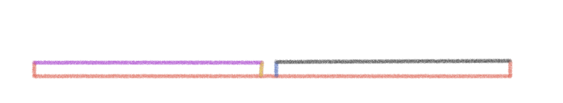
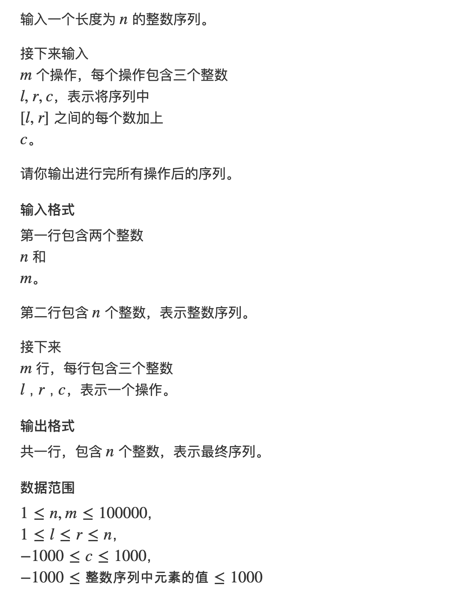

## algorithm
### 位运算快速幂

```
    //计算pow(a, b)
    pow(int a, int b) {
        long long ans = 1;
        for (; b; b >>= 1) {
            if (b & 1)
                ans *= a;
            a *= (long long)a;
        }
        return ans;
    }
```

### 使用位运算处理指数形枚举问题
```
//有n个数,2的n次方种结果
int k = 1;
for (int i = 1; i < n; i++) {
    k <<= 1;
    k |= 1;
}
for (int i = 0; i <= k; i++) {
    int j = i;
    while (j > 0) {
        if (j & 1) {
            //处理
        }
        j >>= 1;
    }
}
```
### 快速排序

分治思想
1. 确定分界点x x可以是左边界q[l]，中间值q[(l + r) / 2],或右边界q[r]
2. 调整区间，让x左边的数小于等于x，x右边的数大于等于x，等于x的话在左右都可以
3. 递归处理左右两边

第二步是重点，一个暴力做法是：
 
- 开两个数组a[], b[]
- 扫描q[l~r],小于等于x的放a[]里，大于等于x的放b[]里
- a[] -> q[], b[] -> q[]

快排模板：
```
void quick_sort(int q[], int l, int r) {
    if (l >= r)
        return;
    int x = q[l], i = l - 1, j = r + 1;//每次都是先移动一次再判断，因此初始化时在边界外,所以是do-while
    while (i < j) {
        do i++; while (q[i] < x);
        do j--; while (q[j] > x);
        if (i < j) swap(q[i], q[j]);
    }
    quick_sort(q, l, j);
    quick_sort(q, j + 1, r);
}
```

链表快排：
同样是找一个数进行划分,left指针指向比这个数小的节点，mid指针指向等于这个数的节点，right指针指向大于这个数的节点,再递归处理left指针和right指针指向的节点
链表快排是稳定的
```
struct ListNode {
    int val;
    ListNode *next;
    ListNode(int x) : val(x), next(NULL) {}
};//链表节点

ListNode* get_tail(ListNode* head) {
    while (head->next) head = head->next;
    return head;
}

ListNode* quickSortList(ListNode* head) {
    if (!head || !head->next) return head;
    
    auto left = new ListNode(-1), mid = new ListNode(-1), right = new ListNode(-1);
    auto ltail = left, mtail = mid, rtail = right;
    int val = head->val;
    for (auto p = head; p; p = p->next) {
        if (p->val < val) ltail = ltail->next = p;
        else if (p->val == val) matil = mtail->next = p;
        else rtail = rtail->next = p;
    }
    
    ltail->next = mtail->next = rtail->next = NULL;
    left->next = quickSortList(left->next);
    right->next = quickSortList(right->next);
    
    //拼接
    get_tail(left)->next = mid->next;
    get_tail(left)->next = right->next;
    
    auto p = left->next;
    delete left;
    delete mid;
    delete right;
    return p;
}  
```
### 快速选择算法 时间复杂度O(n)
用于选择第k大的数
先选择一个分界点，假设有sl个数在分界点左边：
当k <= sl时，递归左半边找第k大的数
当k > sl时，递归右半边，找右半边里第k - sl大的数
如果区间长度为1了，就找到了
```
int q[N];
int qsort(int l, int r, int k) {
    if (l == r) return q[l];
    int x = q[l + r >> 1], i = l - 1, j = r + 1;
    while (i < j) {
        do i++; while (q[i] < x);
        do j--; while (q[j] > x);
        if (i < j) swap(q[i], q[j]);
    }
    int sl = j - l + 1;
    if (k <= sl) return qsort(l, j, k);
    return qsort(j + 1, r, k - sl);
}
```
### 归并排序
在中间位置将数组分为左边和右边
1. 确定分界点 mid = (l + r) / 2

2. 递归排序左边和右边

3. 归并 合二为一  重点

```
//左右闭区间
int temp[N];
void merge_sort(int q[], int l, int r) {
    if (l >= r) return;
    int mid = l + r >> 1;
    merge_sort(q, l, mid);
    merge_sort(q, mid + 1, r);
    int k = 0, i = l, j = mid + 1;
    while (i <= mid && j <= r) {
        if (q[i] <= q[j]) temp[k++] = q[i++];
        else temp[k++] = q[j++];
    }
    while (i <= mid) temp[k++] = q[i++];
    while (j <= r) temp[k++] = q[j++];
    for (i = l, j = 0; i <= r; i++, j++) q[i] = temp[j];
}
```
### 二分查找

不一定要有序，需要的是前半段和后半段有不同的性质，二分可以把分界点找到
```
//区间[l, r]被分为[l, mid]和[mid + 1, r]时使用，
int bsearch_1(int l, int r)
{
    while (l < r) {
        int mid = l + r >> 1;
        if (check(mid)) r = mid;
        else l = mid + 1;
    }
    return l;
}
//区间[l, r]被划分为[l, mid - 1]和[mid, r]时使用:
int bsearch_2(int l, int r) {
    while (l < r) {
        int mid = l + r + 1 >> 1;
        if (check(mid)) l = mid;
        else r = mid - 1;
    }
    return l;
}
```

查找的都是check(mid)的边界
### 高精度加法 (两个正整数）
#### 要点1 数的低位存到数组的低位
#### 要点2 注意进位
```
vector<int> add(const vector<int> &A, const vector<int> &B) {
    vector<int> C;
    int t = 0;
    for (int i = 0; i < A.size() || i < B.size(); i++) {
        if (i < A.size()) t += A[i];
        if (i < B.size()) t += B[i];
        C.push_back(t % 10);
        t /= 10;
    }
    if (t)
        C.push_back(1);
    return C;
}
int main() {
    string a, b;
    cin >> a >> b;
    vector<int> A, B;
    for (int i = a.size() - 1; i >= 0; i--) {
        A.push_back(a[i] - '0');
    }
    for (int i = b.size() - 1; i >= 0; i--) {
        B.push_back(b[i] - '0');
    }
    vector<int> C = add(A, B);
    for (int i = C.size() - 1; i >= 0; i--)
        printf("%d", C[i]);
    return 0;
}
```
### 高精度减法（两个负整数）
#### 先判断A是否大于B，若A < B计算就-(B-A)
```
//判断A和B谁大
bool cmp(const vector<int> &A, const vector<int> &B) {
    if (A.size() != B.size())
        return A.size() > B.size();
    for (int i = A.size() - 1; i >= 0; i--) {
        if (A[i] != B[i])
            return A[i] > B[i];
    }
    return true;
}
//减法
vector<int> sub(const vector<int> &A, const vector<int> &B) {
    vector<int> C;
    for (int i = 0, t = 0; i < A.size(); i++) {
        t = A[i] - t;
        if (i < B.size()) t -= B[i];
        C.push_back((t + 10) % 10);//t如果小于0,t += 10，t如果大于等于0就还是t,再取模时，(t + 10)和t对10取模结果是一样的，所以合并起来
        if (t < 0) t = 1;
        else t = 0;
    }
    while (C.size() > 1 && C.back() == 0) C.pop_back();//去掉前导0，比如124-120 = 004要去掉前面的0
    return C;
}
//输入输出
int main() {
    string a, b;
    cin >> a >> b;
    int alen = a.size(), blen = b.size();
    vector<int> A, B;
    for (int i = alen - 1; i >= 0; i--)
        A.push_back(a[i] - '0');
    for (int i = blen - 1; i >= 0; i--)
        B.push_back(b[i] - '0');
    if (cmp(A, B)) {
        vector<int> C = sub(A, B);
        for (int i = C.size() - 1; i >= 0; i--)
            cout << C[i];
    }
    else {
        vector<int> C = sub(B, A);
        cout << "-";
        for (int i = C.size() - 1; i >= 0; i--)
            cout << C[i];
    }
}
```

### 高精度乘法

#### 一般是简化版的高精度，一个大数与一个不超过一万的数相乘

```
//乘法
vector<int> mul(vector<int> &A, int b) {
    vector<int> C;
    int t = 0;
    for (int i = 0; i < A.size() || t; i++) {
        if (i < A.size())
            t = A[i] * b + t;
        C.push_back(t % 10);
        t /= 10;
    }
    while (c.size() > 1 && c.back() == 0) c.pop_back();
    return C;
}
//输入输出

int main() {
    string a;
    int b;
    cin >> a >> b;
    vector<int> A;
    for (int i = a.size() - 1; i >= 0; i--)
        A.push_back(a[i] - '0');
    auto C = mul(A, b);
    for (int i = C.size() - 1; i >= 0; i--) printf("%d", C[i]);
}
```

### 高精度除法
#### 同样是一个大数除以一个较小的数
除法从最高位开始除，可以把数的高位存到地址的低位，但为了统一，还是高位存高位，低位存低位
```
//除法
//C存商，r是余数
vector<int> sub(vector<int> &A, int b, int &r) {
    vector<int> C;
    r = 0;
    for (int i = A.size() - 1; i >= 0; i--) {
        r = r * 10 + A[i];
        C.push_back(r / b);//这里C的低位存的数的高位
        r = r % b;
    }
    reverse(C.begin(), C.end());//将C翻转过来
    while (C.size() > 1 && C.back() == 0) C.pop_back();
    return C;
}
//输入输出
int main() {
    string a;
    int b;
    cin >> a >> b;
    vector<int> A;
    for (int i = a.size() - 1; i >= 0; i--)
        A.push_back(a[i] - '0');
    int r = 0;
    auto C = sub(A, b, r);
    for (int i = C.size() - 1; i >= 0; i--) printf("%d", C[i]);
    cout << endl << r;
}
```
### 前缀和
#### 作用：计算数组一个区间的和
#### 如何计算前缀和：s[0] = 0, s[i] = s[i - 1] + a[i]
#### 这里前缀和要从1开始，数组的元素也从1开始计数
一维前缀和
```
const int N = 1e5 + 10;
int a[N];
int n, m;
int s[N];
int main() {
    scanf("%d%d", &n, &m);
    for (int i = 1; i <= n; i ++ ) scanf("%d", &a[i]);//数组也从1开始存
    for (int i = 1; i <= n; i ++ ) s[i] = s[i - 1] + a[i]; // 前缀和的初始化
    while (m--) {
        int l, r;
        scanf("%d%d", &l, &r);
        printf("%d\n", s[r] - s[l - 1]); // 区间和的计算
    }
    return 0;
}
```
二维前缀和
作用：可以用来计算子矩阵的和
如何求二维前缀和：S[x2][y2] = S[x2 - 1][y2] + S[x2][y2 - 1] - S[x2 - 1][y2 - 1] + a[x2][y2]
如何用二维前缀和计算子矩阵和：x1,y1 x2,y2 S[x2][y2] - S[x1 - 1][y2] - S[x2][y1 - 1] + S[x1 - 1][y1 - 1]
```
#include<iostream>
using namespace std;
const int N = 1e3 + 10;
int s[N][N];//不能开太大，否则报错
int a[N][N];
int main() {
    int n, m, q;
    scanf("%d%d%d", &n, &m, &q);
    for (int i = 1; i <= n; i++) {
        for (int j = 1; j <= m; j++) {
            scanf("%d", &a[i][j]);
        }
    }
    //求前缀和
    for (int i = 1; i <= n; i++) {
        for (int j = 1; j <= m; j++) {
            s[i][j] = s[i - 1][j] + s[i][j - 1] - s[i - 1][j - 1] + a[i][j];
        }
    }
    //用前缀和
    while (q--) {
        //q个询问
        int x1, y1, x2, y2;
        scanf("%d%d%d%d", &x1, &y1, &x2, &y2);
        printf("%d\n", s[x2][y2] - s[x1 - 1][y2] - s[x2][y1 - 1] + s[x1 - 1][y1 - 1]);
    }
    return 0;
}
```

### 差分
#### 差分与求前缀和互为逆运算，差分是给一定个数组A,构造一个数组B，使A为B的前缀和数组
构造过程：


> B[1] = A[1]
> B[2] = A[2] - A[1]
> B[3] = A[3] - A[2] ...

作用：可以用O(1)的时间给数组A某区间的每一项都加一个数c
eg: 给数组A的区间[l, r]加上c, B[l] += c, B[r + 1] -= c;
因此不用考虑构造过程，直接每个[i, i]区间差分就行

例题：

输入
```
6 3
1 2 2 1 2 1
1 3 1
3 5 1
1 6 1
```
输出
```
3 4 5 3 4 2
```

```
//m个操作，每一个操作给数组的[l, r]区间加c，输出最后结果
#include<iostream>
using namespace std;
const int N = 1e5 + 10;
int a[N], b[N];
int n, m;
void insert(int l, int r, int c) {
    b[l] += c;
    b[r + 1] -= c;
}
int main() {
    scanf("%d%d", &n, &m);
    for (int i = 1; i <= n; i++) scanf("%d", &a[i]);
    for (int i = 1; i <= n; i++) insert(i, i, a[i]); //构造差分数组，给每个区间[i, i]加一个a[i]
    while (m--) {
        int l, r, c;
        scanf("%d%d%d", &l, &r, &c);
        insert(l, r, c);
    }
    //计算原数组
    for (int i = 1; i <= n; i++) b[i] += b[i - 1];
    //输出
    for (int i = 1; i <= n; i++) printf("%d ", b[i]);
    return 0;
}
```

二维差分：
```
#include<iostream>
using namespace std;
const int N = 1e3 + 10;
int a[N][N], b[N][N];
int n, m, q;
void insert(int x1, int y1, int x2, int y2, int c) {
    b[x1][y1] += c;
    b[x2 + 1][y1] -= c;
    b[x1][y2 + 1] -= c;
    b[x2 + 1][y2 + 1] += c;
}
int main() {
    scanf("%d%d%d", &n, &m, &q);
    for (int i = 1; i <= n; i++)
        for (int j = 1; j <= m; j++)
            scanf("%d", &a[i][j]);
    for (int i = 1; i <= n; i++) {
        for (int j = 1; j <= m; j++) {
            insert(i, j, i, j, a[i][j]);
        }
    }
    while (q--) {
        int x1, y1, x2, y2, c;
        cin >> x1 >> y1 >> x2 >> y2 >>  c;
        insert(x1, y1, x2, y2, c);
    }
    for (int i = 1; i <= n; i++) {
        for (int j = 1; j <= m; j++) {
            b[i][j] += b[i - 1][j] + b[i][j - 1] - b[i - 1][j - 1];
        }
    }
    for (int i = 1; i <= n; i++) {
        for (int j = 1; j <= m; j++) {
            printf("%d ", b[i][j]);
        }
        puts("");
    }
    return 0;
}
```
### 双指针算法
模板：
``` c++
for (int i = 0, j = 0; i < n; i++) {
    while (j < i && check(i, j) j++;
    //具体逻辑
}
```
核心思想：优化，看i和j有什么单调关系
```
for (int i = 0; i < n; i++)
    for (int j = 0; j < n; j++)
        O(n^2)
//将上面的暴力优化到O(n)
```

### 位运算
1. 求n的二进制里的第k位
```
n >> k & 1  
```
2. lowbit(X)，返回X的最后一个1，X=1010 lowbit(X) = 0010

实现方式：X & -X
可以统计X里面1的个数

### 离散化

含义：一堆数个数不多，但值域很大，比如：值域从0到10^9,但个数可能只有10^5个，有可能会需要把它们当作下标来使用，这时候需要映射到[0, 10^5]这个值域里

eg: a[]: 1, 3, 100, 2000, 500000
映射到    0, 1,   2,    3,       4

1. a[]中可能有重复，需要去重

```
vector<int> a;//存储所有待离散化的值
sort(a.begin(), a.end());
a.erase(unique(a.begin(), a.end()), a.end());//去掉重复元素
//unique()函数返回去重后的尾端，再直接擦除掉
```
2. 计算每个元素离散化之后的值 

```
//使用二分进行计算
int find(x) {//找到第一个大于等于x的位置
    int l = 0, r = a.size() - 1;
    while (l < r) {
        int mid = l + r >> 1;
        if (a[mid] >= x) r = mid;
        else l = mid + 1;
    }
    return r + 1;//加1从1开始映射
}
```

### 区间合并

1. 先按左端点进行排序
2. 判断剩下的区间与当前区间是否有交集

q1.ed与q2.st比较
```
#include <iostream>
#include <vector>
#include <algorithm>

using namespace std;

typedef pair<int, int> PII;

void merge(vector<PII> &segs)
{
    vector<PII> res;

    sort(segs.begin(), segs.end());

    int st = -2e9, ed = -2e9;
    for (auto seg : segs)
        if (ed < seg.first)
        {
            if (st != -2e9) res.push_back({st, ed});
            st = seg.first, ed = seg.second;
        }
        else ed = max(ed, seg.second);

    if (st != -2e9) res.push_back({st, ed});

    segs = res;
}

int main()
{
    int n;
    scanf("%d", &n);

    vector<PII> segs;
    for (int i = 0; i < n; i ++ )
    {
        int l, r;
        scanf("%d%d", &l, &r);
        segs.push_back({l, r});
    }

    merge(segs);

    cout << segs.size() << endl;

    return 0;
}
```

### 链表

1. 单链表：邻接表（存图或树）

使用数组模拟单链表，e[N]存val，ne[N]存指向的点，两者通过下标关联
因为大量使用new操作会超时
2. 双链表 优化某些问题

