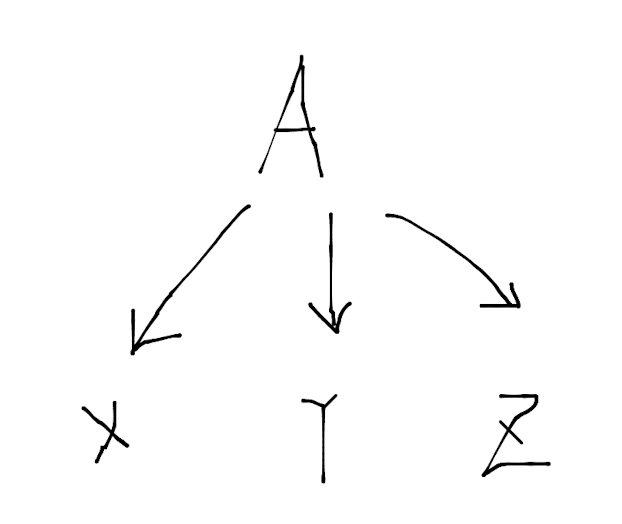

# 编译原理
### 1.引论
1. 编译器的结构
    可分为2部分： 分析部分和综合部分
    1. 分析部分  
    创建源程序的中间表示并收集源程序的信息，把信息存放在符号表中
    输入：源程序
    输出：中间表示 & 符号表
    
    1. 综合部分 
    用中间表示和符号表中的信息构造目标程序
    输入：中间表示 & 符号表
    输出：目标程序
    
   > 分析部分通常被称为编译器的**前端**，而综合部分通常被称为编译器的**后端**
   
   编译过程：顺序执行一组**步骤**，每个步骤把源程序的一种表示方式转换成另一种表示方式
      
      1. 词法分析
       &nbsp;&nbsp;&nbsp;&nbsp;&nbsp;&nbsp;&nbsp;&nbsp;词法分析器读入组成源程序的字符流，并将它们组成有意义的**词素**序列，对于每个词素，词法分析器产生如下形式的 __词法单元\(token)__ 作为输出:
       
                 <token-name, attribute-value>
       
         随后这个token会被传递给下一个步骤，即语法分析。
   &nbsp;&nbsp;&nbsp;&nbsp;&nbsp;&nbsp;&nbsp;&nbsp;在一个token中，token-name是一个由语法分析步骤使用的抽象符号，而第二个attribute-value指向符号表中关于这个token的条目
   
      2. 语法分析
      &nbsp;&nbsp;&nbsp;&nbsp;&nbsp;&nbsp;&nbsp;&nbsp;语法分析器使用词法分析器生成的各个词法单元的第一个分量来创建树形的中间表示。其中，一个常用的表示方法是**语法树**,树中的每个节点表示一个运算，而该节点的子节点表示参与该运算的token
      
         编译器的后续步骤将使用这个语法结构来帮助分析源程序和生成目标程序
     3. 语义分析
         &nbsp;&nbsp;&nbsp;&nbsp;&nbsp;&nbsp;&nbsp;&nbsp;使用语法树和符号表中的信息检查源程序是否和语言定义的语义一致。同时收集类型信息，将其存放在语法树或符号表中，以便在之后的中间代码生成中使用
         
         &nbsp;&nbsp;&nbsp;&nbsp;&nbsp;&nbsp;&nbsp;&nbsp;语义分析的一个重要部分是**类型检查**，编译器检查每个运算符是否有匹配的运算分量
     4. 中间代码生成
     &nbsp;&nbsp;&nbsp;&nbsp;&nbsp;&nbsp;&nbsp;&nbsp;语法树就是一种中间表示形式，它们通常在语法分析和语义分析中使用。
     
        &nbsp;&nbsp;&nbsp;&nbsp;&nbsp;&nbsp;&nbsp;&nbsp;但很多编译器还生成一个类机器语言的中间表示，这个表示有两个重要性质：**1.易于生成， 2.能被轻松翻译为目标机器上的语言**， 例如三地址码
        
    5. 代码优化 
       &nbsp;&nbsp;&nbsp;&nbsp;&nbsp;&nbsp;&nbsp;&nbsp;机器无关的代码优化：改进中间代码，以便生成更好的目标代码。使用一个简单的中间代码生成算法，然后在进行代码优化是生成优质目标代码的一个合理方法
       
    6. 代码生成
       &nbsp;&nbsp;&nbsp;&nbsp;&nbsp;&nbsp;&nbsp;&nbsp;代码生成器的输入是源程序的中间表示形式，输出是目标语言。代码生成的一个重要方面是**合理分配寄存器以存放变量的值**
       
    7. 符号表管理
       &nbsp;&nbsp;&nbsp;&nbsp;&nbsp;&nbsp;&nbsp;&nbsp;编译器的重要功能之一是记录源程序中使用的变量的名字，并收集和每个名字的各种属性有关的信息，例如类型、作用域等，对于一个过程的名字，还可以收集它的参数数量和类型，参数传递方式等。
       &nbsp;&nbsp;&nbsp;&nbsp;&nbsp;&nbsp;&nbsp;&nbsp;符号表这个数据结构用来使编译器迅速找到每个名字的记录，记录的字段就是名字的各个属性
    
    8. 将多个步骤组合成趟(pass)
        &nbsp;&nbsp;&nbsp;&nbsp;&nbsp;&nbsp;&nbsp;&nbsp;多个步骤的活动可以被组成一趟。
        
    9. 编译器构造工具
       &nbsp;&nbsp;&nbsp;&nbsp;&nbsp;&nbsp;&nbsp;&nbsp;一些常用的编译器构造工具包括：
       * 语法分析器的生成器
       * 扫描器的生成器
       * 语法制导的翻译引擎
       * 代码生成器的生成器
       * 数据流分析引擎
       * 编译器构造工具集
       
2. 针对计算机体系结构的优化
 
     高性能的系统一般用到两种技术：
     1. 并行 
     2. 内存层次结构
     
     #### 并行性
     &nbsp;&nbsp;&nbsp;&nbsp;&nbsp;&nbsp;&nbsp;&nbsp;所有的现代微处理器都使用了指令级并行性，但这种并行大部分情况对程序员是透明的。硬件动态检测程序员写的顺序指令之间的依赖关系，在可能的时候并行的发出指令。不管硬件是否对指令进行重新排序，编译器都可以重新安排指令顺序。
     &nbsp;&nbsp;&nbsp;&nbsp;&nbsp;&nbsp;&nbsp;&nbsp;指令级的并行也显示出现在指令集中，VLIW（非常长指令字）机器拥有可并行执行多个运算的指令，人们已经开发出了相应的编译器技术，从顺序程序出发为这样的机器自动生成代码。现在的程序员可以为多核编写多线程代码，也可以通过编译器从传统的顺序程序自动生成并行代码
     
     #### 内存层次结构
     &nbsp;&nbsp;&nbsp;&nbsp;&nbsp;&nbsp;&nbsp;&nbsp;它由几层具有不同速度和大小的存储器组成。其中高速缓存和物理内存是对指令集合透明的，因此高效使用寄存器是优化一个程序时要处理的重要问题
     
### 2.一个简单的语法制导翻译器

  #### 1.语法定义
  使用**上下文无关文法**来描述程序设计语言的语法
  - 1.1 文法定义
  一个上下文无关文法由四个元素组成：
       1. 终结符号集合： 也称“**词法单元**”。终结符号是该文法所定义语言的基本符号的集合
       2. 非终结符号集合： 也称“**语法变量**”。每个非终结符表示一个终结符的集合
       3. 产生式集合，每个产生式包括一个非终结符（也叫产生式头或左部）、一个箭头和一个由终结符和非终结符组成的序列（也叫产生式体或右部）。它用来表示某个构造的某种书写形式
       4. 指定一个非终结符作为**开始**符号
  
  - 1.2 推导
    &nbsp;&nbsp;&nbsp;&nbsp;&nbsp;&nbsp;&nbsp;&nbsp;从开始符号出发，不断将某个非终结符替换为该非终结符的某个产生式的体。从开始符号可以推出的所有终结符串的集合称为该文法的**语言**
    
    &nbsp;&nbsp;&nbsp;&nbsp;&nbsp;&nbsp;&nbsp;&nbsp;语法分析的任务：接受一个终结符号串作为输入，检查是否可以从文法的开始符号推导出这个串，如果不能，则报告该终结符号串中包含的语法错误
    
  - 1.3 语法分析树
    &nbsp;&nbsp;&nbsp;&nbsp;&nbsp;&nbsp;&nbsp;&nbsp;语法分析树用图形的方式展现了从文法的开始符号推导出相应语言中的符号串的过程，若非终结符A有一个产生式A->XYZ，则语法分析树中就可能有：
    

   对于一个上下文无关文法，该文法的一棵**语法分析树**具有一下性质：
      1. 根节点的标号为文法的开始符号
      2. 每个叶子节点的标号为一个终结符号或一个ε
      3. 每个内部节点的标号为一个非终结符号
      4. 若非终结符A是某内部节点标号，它的字节点的标号从左到右分别为X1,X2,...,Xn，那么必然有产生式A->X1X2...Xn，若A->ε是一个产生式，那么标号为A的节点可以有一个标号为ε的子节点

      一棵语法分析树的叶子结点从左向右构成了树的推导结果，即从这棵语法分析树根节点上的非终结符推导得到的符号串
      
      为一个给定的终结符号串构建一棵语法分析树的过程称为对该符号串进行**语法分析**
      
- 1.4 二义性
      &nbsp;&nbsp;&nbsp;&nbsp;&nbsp;&nbsp;&nbsp;&nbsp;如果一个文法可能有多棵语法分析树能够生成同一个给定的终结符号串，这样的文法称为具有**二义性**，要证明一个文法具有二义性只需要找到一个终结符号串，说明它可以由两颗或更多的语法分析树生成
- 1.5 运算符的结合性
      &nbsp;&nbsp;&nbsp;&nbsp;&nbsp;&nbsp;&nbsp;&nbsp;当一个运算分量(比如9 + 5 + 2中的5)的左右两侧都有运算符时，需要决定哪个运算符被应用于这个运算分量。而运算符"+"是左结合的，当一个运算分量左右两侧都有"+"时，它属于左边的运算符，在大部分程序设计语言中，加减乘除都是左结合的。右结合的运算符有赋值运算符"="等
- 1.6 运算符的优先级
      &nbsp;&nbsp;&nbsp;&nbsp;&nbsp;&nbsp;&nbsp;&nbsp;对于表达式9 + 5 * 2。该表达式由两种可能的解释，即(9 + 5) * 2或9 + (5 * 2)，而结合性规则只能用于同一运算符的多次出现，因此需要定义运算符之间的相对优先关系
#### 语法制导翻译
&nbsp;&nbsp;&nbsp;&nbsp;&nbsp;&nbsp;&nbsp;&nbsp;语法制导翻译是通过向一个文法的产生式附加一些规则或程序片段得到的
例如
`     expr -> expr1 + term
`
（expr1中的1仅用来与产生式头中的expr进行区分），我们可以利用expr的结构，用如下伪代码来翻译expr:

`     翻译expr1;翻译term;处理+;
`
两个与语法制导翻译相关的概念：
1. 属性
 &nbsp;&nbsp;&nbsp;&nbsp;&nbsp;&nbsp;&nbsp;&nbsp;表示与某个程序构造相关的量，如表达式的数据类型、生成的代码中的指令数量等
2. （语法制导的）翻译方案
 &nbsp;&nbsp;&nbsp;&nbsp;&nbsp;&nbsp;&nbsp;&nbsp;将程序片段附加到一个文法的各个产生式上的表示法，当语法分析过程中使用一个产生式时，相应的程序片段就会执行
- 1.综合属性
&nbsp;&nbsp;&nbsp;&nbsp;&nbsp;&nbsp;&nbsp;&nbsp;将属性和文法的非终结符及终结符号相关联。然后给文法的各个产生式附加上语义规则。对于语法分析树中的一个节点，如果它和它的子节点之间的关系符合某个产生式，那么该产生式对应的规则就描述了如何计算这个节点上的属性。
&nbsp;&nbsp;&nbsp;&nbsp;&nbsp;&nbsp;&nbsp;&nbsp;**语法制导定义**把每个文法符号和一个属性集合相关联，并且把每个产生式和一组**语义规则**相关联，这些规则用于计算与该产生式中符号相关联的属性值
> 如果一棵语法分析树的各个节点上标记了相应的属性值，那么就称这棵语法分析树为**注释语法分析树**
> 如果某个属性在语法分析树节点N上的值是由N的子节点和N本身的属性值确定的，那么这个属性就称为**综合属性**，它只需要对语法分析树进行一次自底向上的遍历，就可以计算出属性的值，另外还有一种重要属性：**继承属性**，它的值由该节点本身、父节点以及兄弟节点上的属性值决定
- 一个简单的语法制导定义例子
  | 产生式 | 语义规则 |
  | ----  | ------  |
  |term -> 0 | term.t = '0'|
- 2.翻译方案
&nbsp;&nbsp;&nbsp;&nbsp;&nbsp;&nbsp;&nbsp;&nbsp;它不同与上面把字符串作为属性值附加在语法分析树节点上，而是通过运行程序片段，逐步生成同步的翻译结果。
&nbsp;&nbsp;&nbsp;&nbsp;&nbsp;&nbsp;&nbsp;&nbsp;**语法制导翻译方案通过在文法产生式中附加一些程序片段来描述翻译结果**，它与语法制导定义相似，只是显示指定了语义规则的计算顺序。被嵌入到产生式体中的程序片段称为**语义动作**。一个语义动作用花括号括起来，并写入到产生式体中，它的执行位置也由此指定，如下所示
` rest -> + term {print('+')} rest1
`

#### 语法分析
#### 词法分析
#### 符号表
#### 中间代码生成