# 网络

## 基础
#### TCP/IP网络模型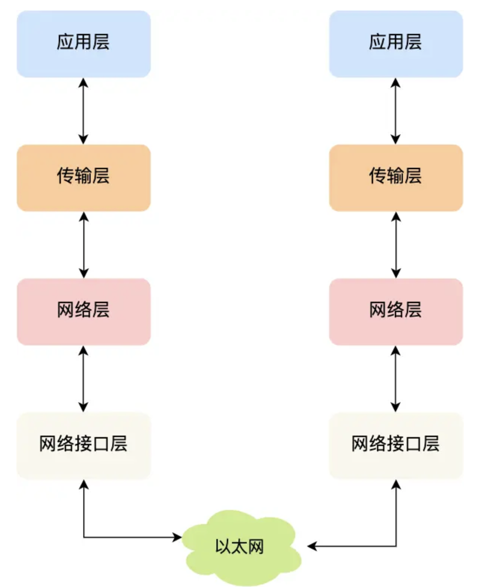

1. 应用层

协议有：HTTP, DNS, SMTP, FTP
应用层工作在操作系统的用户态，传输层及一下工作在内核态

2. 传输层

协议有：TCP, UDP
大部分应用使用TCP协议，比如HTTP应用层协议。TCP 相比 UDP 多了很多特性，比如**流量控制**、**超时重传**、**拥塞控制**等，这些都是为了保证数据包能可靠地传输给对方。
UDP只负责发送数据包，不保证数据包是否能抵达对方，但它实时性相对更好，传输效率也高。

对于TCP协议，当传输层的数据包大小超过 MSS（TCP 最大报文段长度） ，就要将数据包分块，这样即使中途有一个分块丢失或损坏了，只需要重新发送这一个分块，而不用重新发送整个数据包。在 TCP 协议中，我们把每个分块称为一个 TCP 段（TCP Segment）。

一台设备上可能有很多应用在传输数据，因此需要用编号将它们区分，这个编号就是**端口**，传输层的报文会携带端口号，由此识别该报文发给哪个应用。

3. 网络层

网络层负责在各种线路和分叉路口中把数据从一个设备传输到另一个设备
协议有：IP协议
IP协议将传输层的报文作为数据部分，再加上IP包头组成IP报文，若IP报文大小超过MTU（以太网中为1500字节），就会再次分片。

网络层需要有区分设备的编号，一般使用IP地址给设备进行编号：

&nbsp;&nbsp;&nbsp;&nbsp;对于**IPV4**协议，IP地址共32位，分成了4段，每段8位，比如192.168.100.1。

为了寻址方便，一般将IP地址分成两种意义：
 - 网络号： 标识该IP地址属于哪个「子网」
 - 主机号： 标识同一「子网」下的不同主机

这里使用「**子网掩码**」计算IP地址的网络号和主机号

Eg.
10.100.122.0/24，后面的/24表示就是 255.255.255.0 子网掩码，255.255.255.0 二进制是「11111111-11111111-11111111-00000000」有24个1

把子网掩码和IP地址进行按位与运算就能得到网络号，
把子网掩码取反后与IP地址进行按位与运算，就可以得到主机号
在寻址过程中，先匹配到子网，才会去找主机。

除了寻址，IP协议还有一个重要功能：**路由**

IP 协议的寻址作用是告诉我们去往下一个目的地该朝哪个方向走，路由则是根据「下一个目的地」选择路径。寻址更像在导航，路由更像在操作方向盘。

4. 网络接口层

该层在网络层的IP头部前加上MAC头部，并封装成数据帧

网络接口层主要为网络层提供「链路级别」传输的服务，负责在以太网、WiFi 这样的底层网络上发送原始数据包，工作在网卡这个层次，使用 MAC 地址来标识网络上的设备。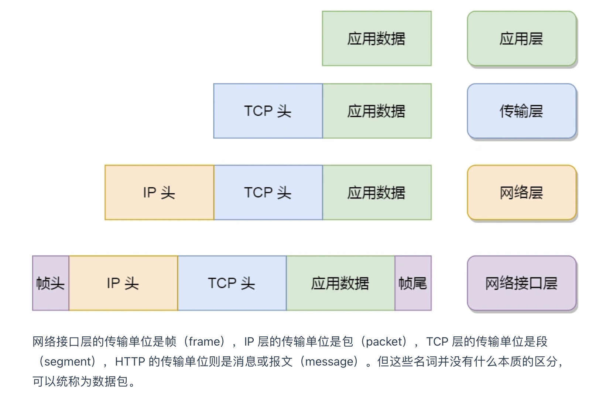

每层的封装格式

### 键入网址到网页显示，期间发生了什么？

1. 浏览器解析URL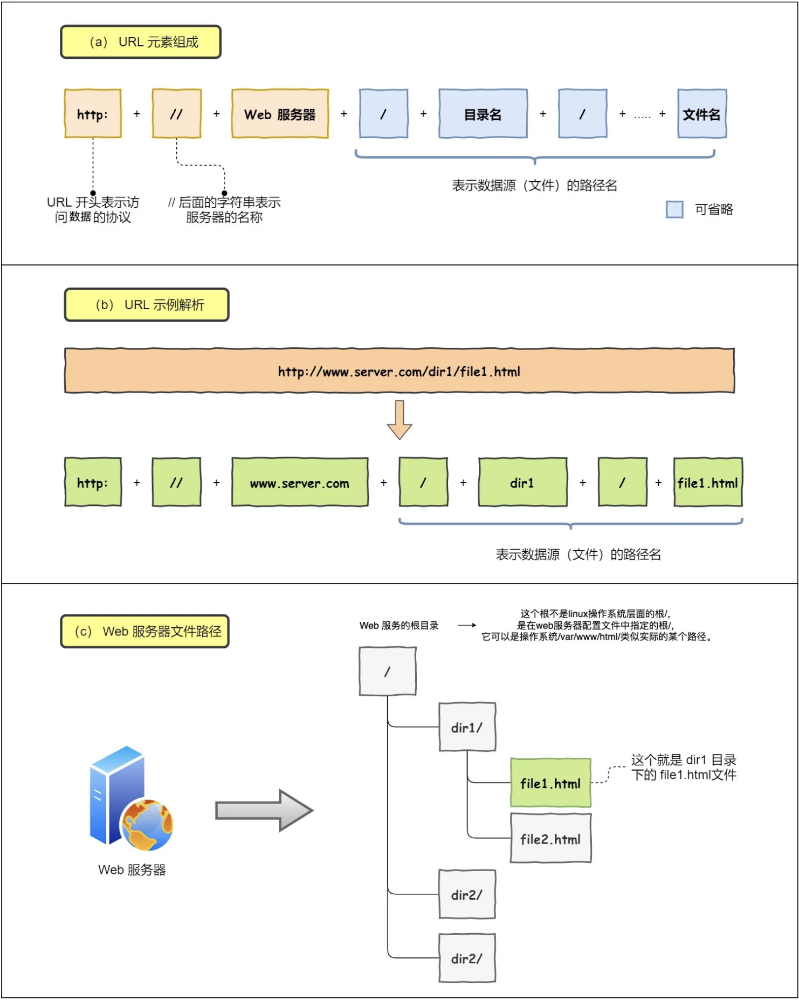
2. 生成HTTP请求信息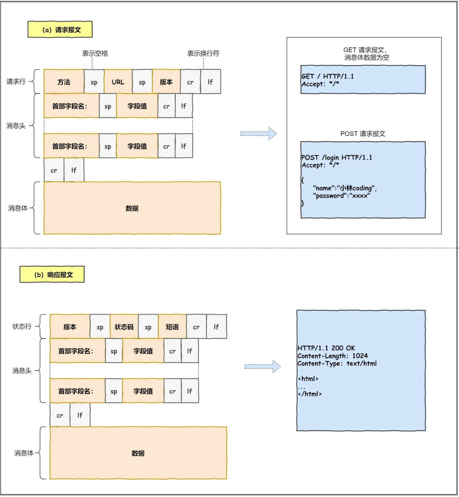
3. 真实地址查询DNS

生成HTTP消息后需要把消息发送给web服务器，在这之前，需要查询服务器域名对应的IP地址，而DNS服务器保存了web服务器域名和IP的对应关系。

DNS中的域名是用**句点**来分隔的，比如www.server.com,域名里越靠右的位置表示其层级越高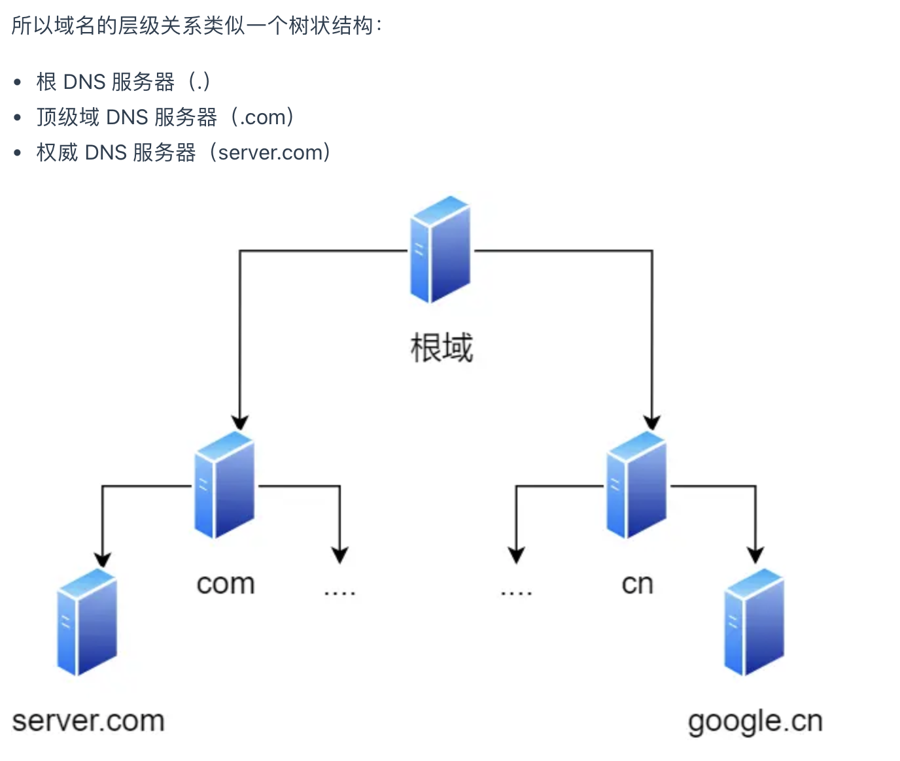

根域的DNS服务器信息保存在互联网中所有的DNS服务器中，所以客户端找到任何一台DNS服务器，就可以通过它找到根域DNS服务器，再一路找到下层的某台目标DNS服务器

> 域名解析流程

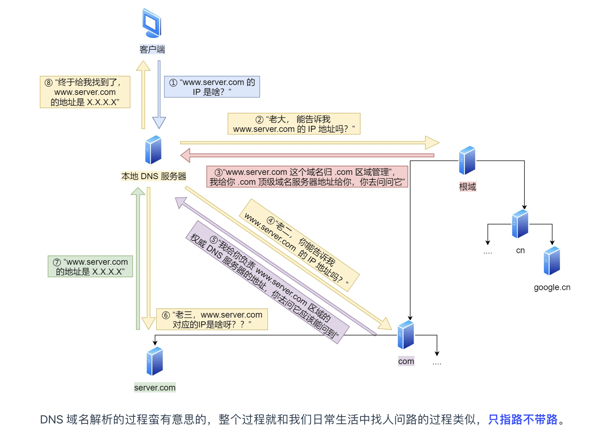

> 每次解析域名都要经过这么多步骤？

浏览器先看自身对这个域名有没有缓存，如果有就直接返回，没有就问操作系统，操作系统查看自己的缓存，如果没有就去hosts文件看，再没有就去问「本地DNS服务器」

数据包找到了目的地后，还需要进行传输，传输的工作交给操作系统里的协议栈，最常用的协议栈是TCP/IP协议栈，它是互联网中最基本和最重要的协议栈。

4. HTTP传输——协议栈

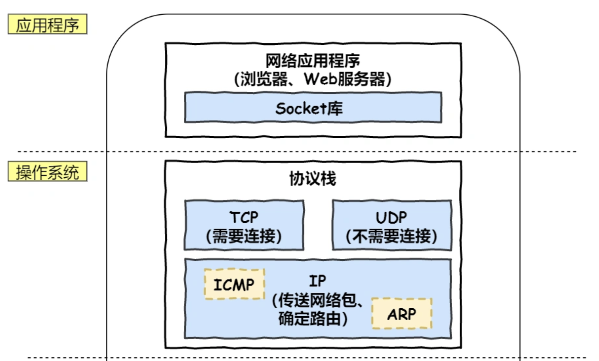

- TCP协议
  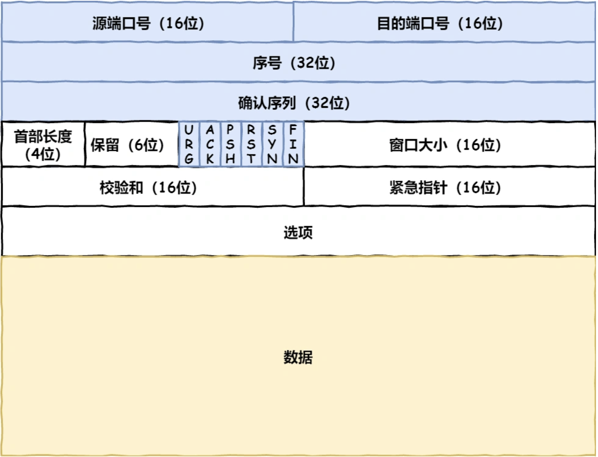
TCP报文格式：

源端口号，目标端口号：没有这些，数据就不知道该发给哪个应用
序号：解决包乱序的问题
确认号：确认发出去对方是否有收到，没收到就重新发送，直到送达，解决丢包问题
状态位：例如 SYN 是发起一个连接，ACK 是回复，RST 是重新连接，FIN 是结束连接等。TCP 是面向连接的，因而双方要维护连接的状态，这些带状态位的包的发送，会引起双方的状态变更。
窗口大小：可以做流量控制，双方各声明一个窗口，标识自己当前的处理能力，让对方别发太快或太慢
TCP还可以做拥塞控制，控制自己发送的速度

> TCP三次握手

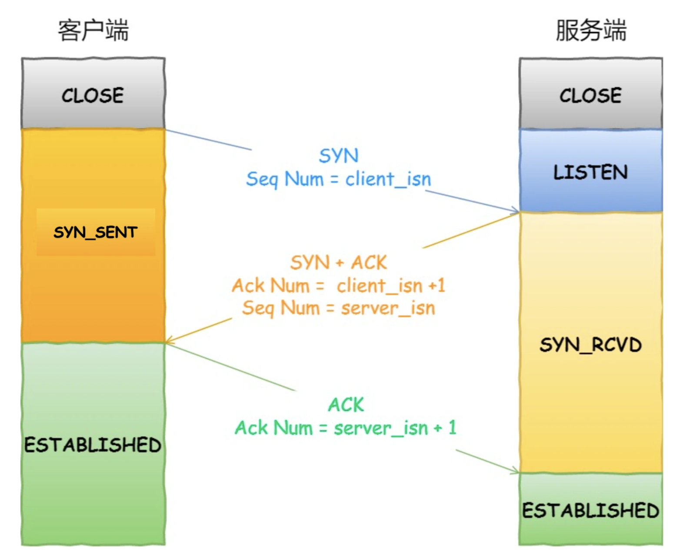

一开始，客户端和服务端都处于 CLOSED 状态。先是服务端主动监听某个端口，处于 LISTEN 状态。

然后客户端主动发起连接 SYN，之后处于 SYN-SENT 状态。

服务端收到发起的连接，返回 SYN，并且 ACK 客户端的 SYN，之后处于 SYN-RCVD 状态。

客户端收到服务端发送的 SYN 和 ACK 之后，发送对 SYN 确认的 ACK，之后处于 ESTABLISHED 状态，因为它一发一收成功了。

服务端收到 ACK 的 ACK 之后，处于 ESTABLISHED 状态，因为它也一发一收了。

> TCP分割报文

若请求消息超过了MSS的长度，TCP就会把数据拆成一块块的数据

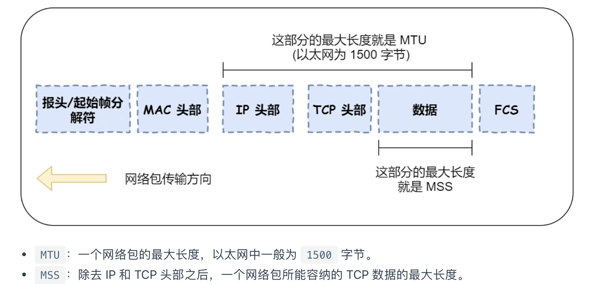

> TCP报文生成

双方建立连接后，TCP报文的数据部分存放HTTP头部+数据，组装好TCP报文后交给网络层处理。

- 远程定位IP

> IP报头

在IP协议里有<nobr style="color:blue;">源地址IP</nobr>和<nobr style="color:blue;">目标地址IP</nobr> 

由于HTTP经过TCP传输，所以在IP包头的协议号填0X06,标识TCP协议

> IP报头生成

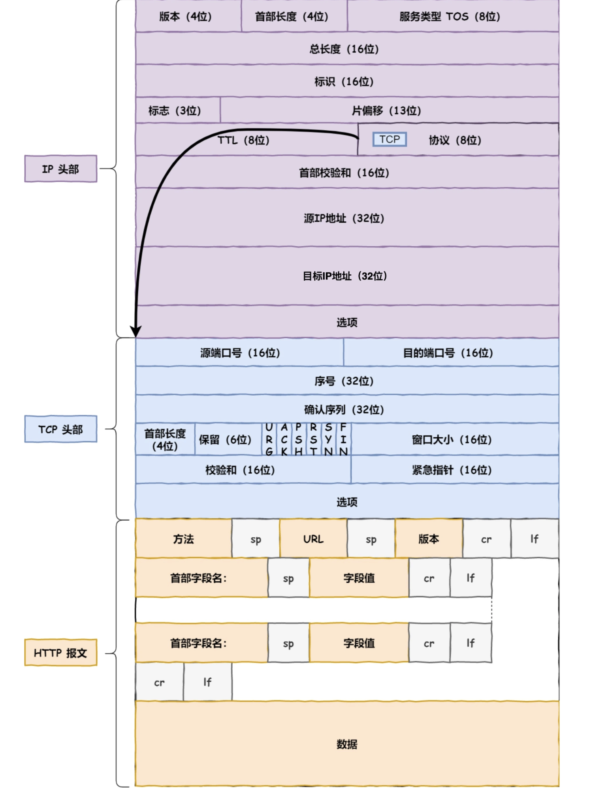

- 两点传输MAC

生成IP头部后，网络包还需要在IP头部前加上MAC头部

> MAC包头格式

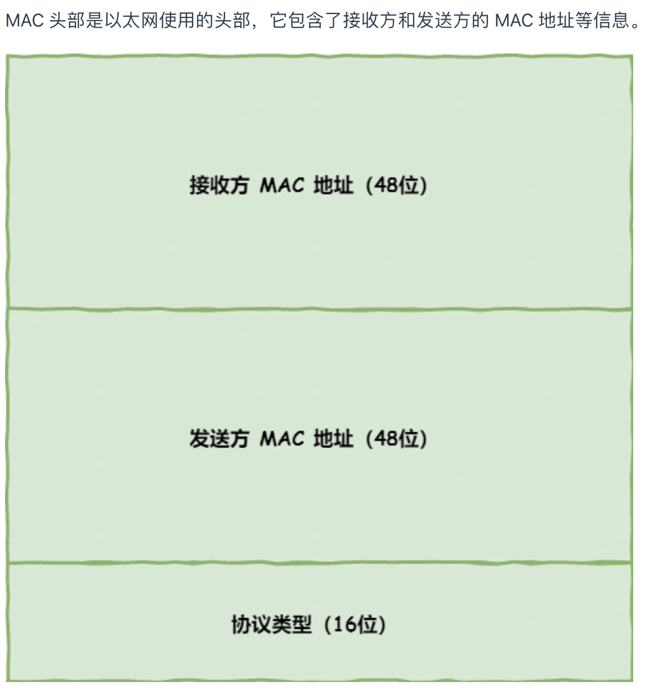

一般TCP/IP通信里，MAC包头的协议类型只使用：

0800：IP协议

0806：ARP协议

> MAC发送方、接收方如何确认？

发送方：MAC 地址是在网卡生产时写入到 ROM 里的，只要将这个值读取出来写入到 MAC 头部就可以了。

接收方：先得搞清楚应该把包发给谁，这个只要查一下路由表就知道了。在路由表中找到相匹配的条目，然后把包发给 Gateway 列中的 IP 地址就可以了。

> 如何获取接收方的MAC地址？

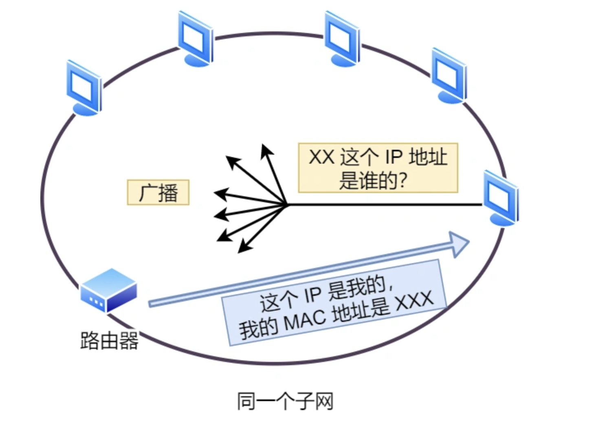
使用ARP协议

> 每次都需要广播吗？

操作系统会把每次的查询结果放到ARP缓存中，发包时先查询缓存，如果没有对方的MAC地址才进行广播

> MAC报文
 
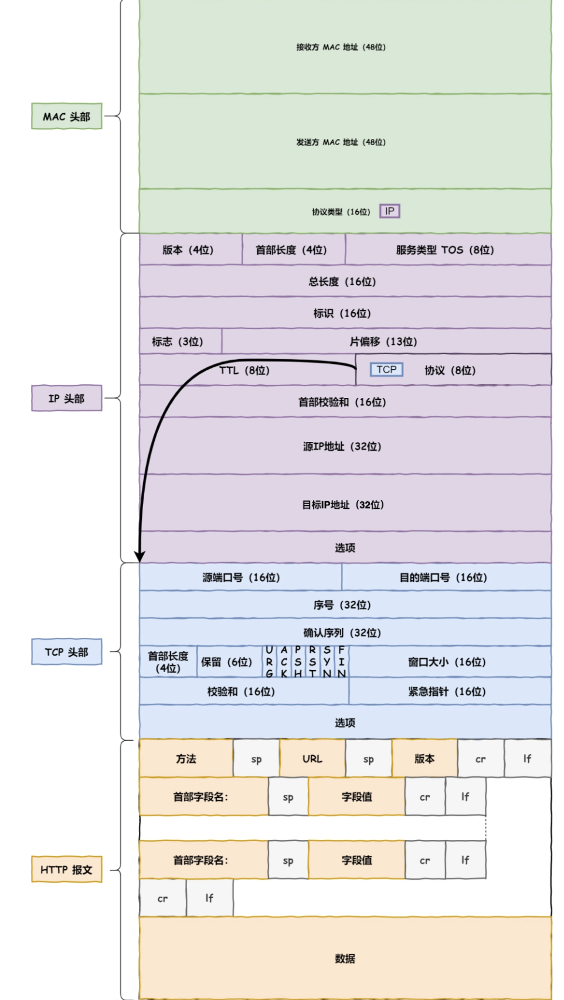

- 出口--网卡

网络包只是内存中的一串二进制数字信息，只有转换为电信号，才能在网线上传输

负责执行这一操作的是网卡，网卡驱动获取网络包之后，会将其复制到网卡内的缓存区中，接着会在其开头加上报头和起始帧分界符，在末尾加上用于检测错误的帧校验序列。
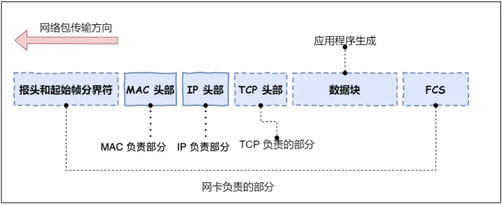

- 送别者--交换机

交换机工作在MAC层

> 交换机的包接受操作

电信号到达网络接口，交换机接受信号，并将其转化为数字信号。然后通过包末尾的FCS校验错误，如果没问题就放到缓冲区，与网卡不同的是：

网卡具有MAC地址，可以通过核对包接收方的MAC地址判断是不是发给自己的，如果不是发给自己的则丢弃；交换机的端口不核对接收方 MAC 地址，而是直接接收所有的包并存放到缓冲区中。因此，和网卡不同，<nobr style="color:blue;">交换机的端口不具有 MAC 地址。</nobr>

放入缓冲区后，需要查询包接收方的MAC地址是否已经在MAC地址表中有记录了，交换机里的MAC地址表主要包含两个信息：连接交换机的设备的MAC地址，这个设备连接在交换机的哪个端口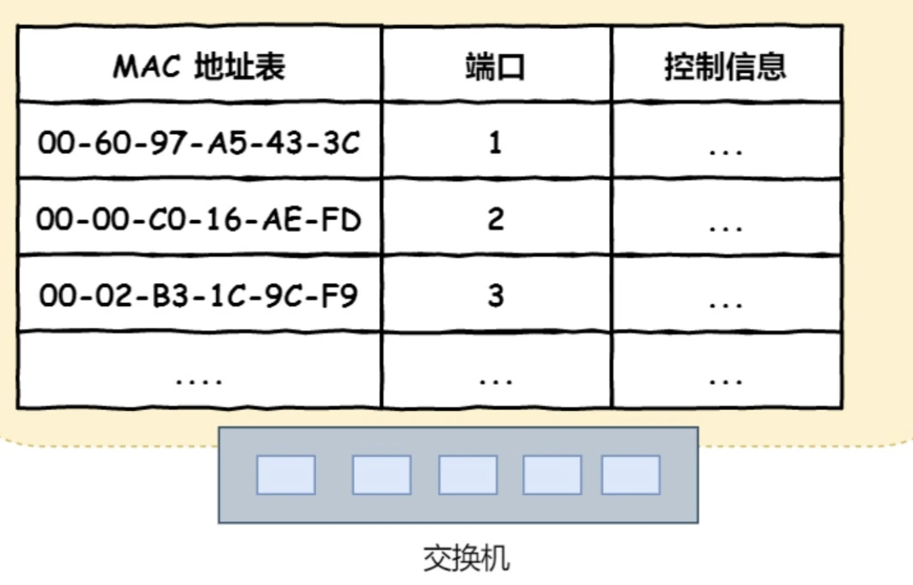

如果找不到MAC地址，就向除了源端口外的所有端口都转发这个包

- 出境大门--路由器

网络包经过交换机后，到达路由器，并在此被转发到下一个路由器或目标设备

> 路由器和交换机的不同有

路由器的各个端口都具有 MAC 地址和 IP 地址，是基于IP设计的**三层网络设备**
交换机的端口不具备MAC地址或IP地址，是基于以太网设计的**二层网络设备**

> 路由器基本原理

路由器的端口具有MAC地址，它可以成为以太网的发送方和接收方，同时还有IP地址。
转发包时，路由器端口会接收发给自己的以太网包，然后路由表查询转发目标，再由相应的端口作为发送方将以太网包发送出去。

> 路由器的包接受操作

和交换机一样把电信号转为数字信号，再进行错误校验，如果没问题就检查 MAC 头部中的接收方 MAC 地址，看看是不是发给自己的包，如果是就放到接收缓冲区中，否则就丢弃这个包。

> 查询路由表确定输出端口

完成包接收操作之后，路由器就会去掉包开头的 MAC 头部。

MAC 头部的作用就是将包送达路由器，其中的接收方 MAC 地址就是路由器端口的 MAC 地址。因此，当包到达路由器之后，MAC 头部的任务就完成了，于是 MAC 头部就会被丢弃。

接下来，路由器会根据 MAC 头部后方的 IP 头部中的内容进行包的转发操作。

> 路由器的发送操作

检查路由表的网关列来判断对方的地址，如果网关为空，就不用再路由了，已经到目标网络了，如果网关是一个IP地址，则这个IP 地址就是我们要转发到的目标地址。

知道对方的 IP 地址之后，接下来需要通过 ARP 协议根据 IP 地址查询 MAC 地址，并将查询的结果作为接收方 MAC 地址。

路由器也有 ARP 缓存，因此首先会在 ARP 缓存中查询，如果找不到则发送 ARP 查询请求。

- 互相扒皮--服务器与客户端

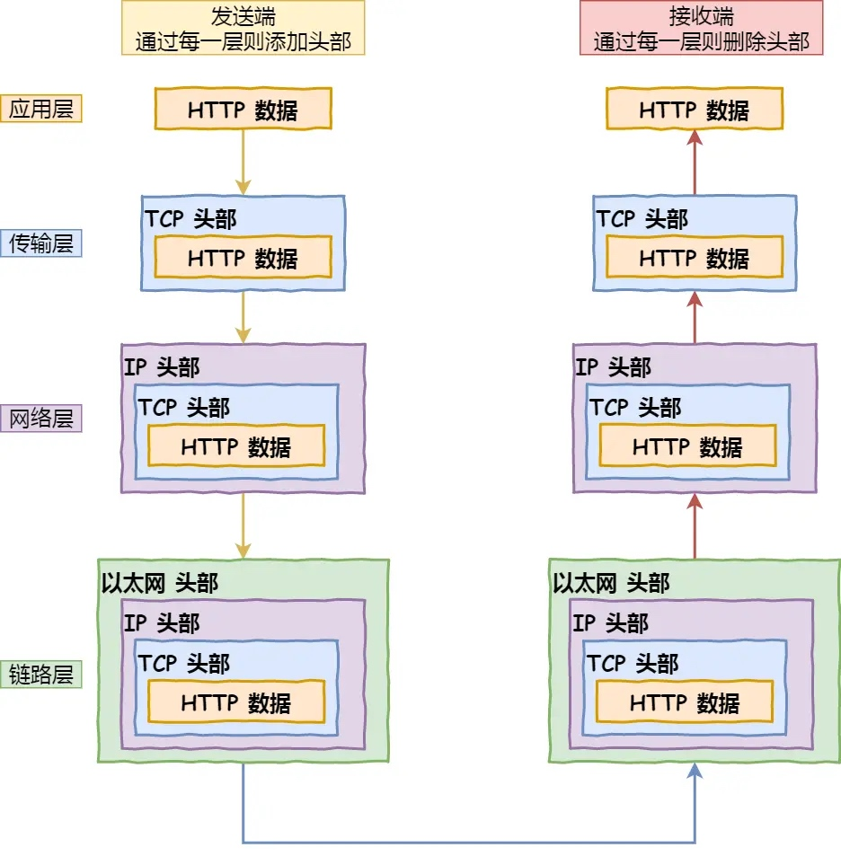

### Linux系统是如何收发网络包的？

1. 网络模型
Linux系统使用TCP/IP模型实现网络协议栈

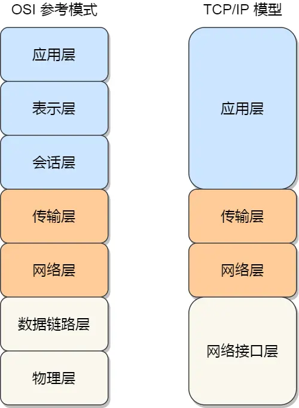

2. Linux网络协议栈

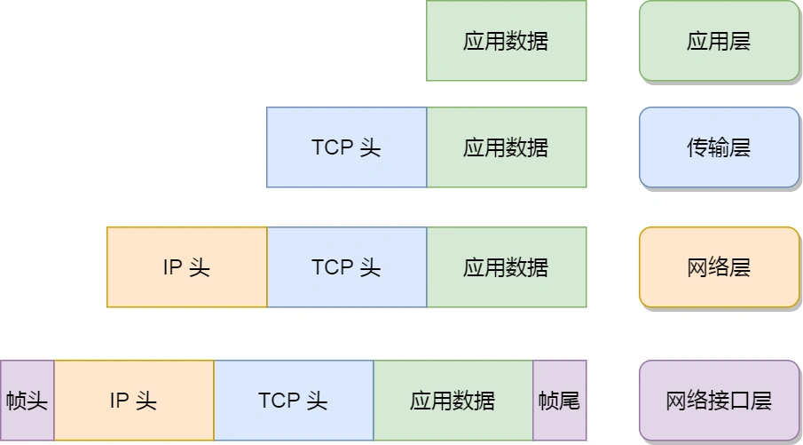

每一层都增加了各自的协议头，增大了包的大小，而以太网的最大传输单元(MTU)是1500字节，也就是单次传输的最大IP包大小。

若网络包超过MTU大小，就会在网络层分片，确保分片后的IP包不会超过MTU大小。

> linux的网络协议栈

- 应用程序需要通过系统调用来跟socket层进行数据交互
- socket下面的是传输层、网络层、网络接口层
- 最下面为网卡驱动以及硬件网卡设备

### linux接受网络包的流程

网卡收到一个网络包后，会用DMA技术将网络包写入到指定的内存地址，也就是写入到 Ring Buffer ，这个是一个环形缓冲区，接着就会告诉操作系统这个网络包已经到达。

> 如何告诉操作系统网络包已到达？

最简单方法：中断，每当网卡收到一个网络包，就触发一个中断告诉操作系统。
缺点：在高性能网络场景下，网络包的数量非常多，就会触发非常多的中断，影响系统的整体效率

NAPI机制：混合中断和轮询的方式来接受网络包，它的核心概念是<nobr style="color:blue;">不采用中断的方式读取数据</nobr>而是首先采用中断唤醒数据接收的服务程序，然后 poll 的方法来轮询数据。

当网络包到达时，先被写入指定的内存地址，再由网卡向CPU发起硬件中断，CPU收到硬件中断请求后，根据中断表，调用已经注册的中断处理函数，硬件中断会暂时屏蔽中断，再发起软中断

> 软中断的处理

当 ksoftirqd 内核线程收到软中断后会从 Ring Buffer 中获取一个数据帧，用 sk_buff 表示，从而可以作为一个网络包交给网络协议栈进行逐层处理。

> 网络协议栈

1. 先进入网络接口层，该层会检查报文的合法性，不合法就丢弃，合法就找出网络包的上层协议类型，比如是IPV4还是IPV6，再去掉帧头和帧尾后交给网络层
2. 网络层取出IP包，判断是交给上层继续处理还是转发出去，如果是发给本机的，就会在IP头里查看上一层协议是TCP还是UDP，接着去掉IP头后交给传输层
3. 传输层取出TCP或UDP头，根据四元组「源IP，源端口，目的IP，目的端口」作为标识，找出对应的Socket，并把数据放到Socket的缓冲区
4. 应用程序调用Socket接口，将Socket缓冲区的数据拷贝到应用层的缓冲区，然后唤醒用户进程

> 发送网络数据时，涉及几次内存拷贝操作？

1. 调用发送数据的系统调用时，数据从用户空间拷贝到内核空间
2. 使用TCP协议时，每次把数据从传输层送到网络层都是拷贝一个，目的是实现TCP协议的可靠传输，等收到这个数据包的ACK时，才会释放传输层的数据包
3. 在网络层中检查数据包的大小有没有超过MTU（单个数据包可以传输的最大字节数），如果超过了就要进行分片，这时候会发生内存拷贝

## HTTP篇

### HTTP常见面试题

#### HTTP基本概念

HTTP是什么？
 

HTTP 是超文本传输协议，也就是HyperText Transfer Protocol。

1. 协议
    HTTP是一个计算机世界里的协议，使用计算机能够理解的语言确立了一种计算机之间交流通信的规范，以及相关的各种控制和错误处理方式
2. 传输
    HTTP是一个在计算机世界里专门用来在**两点之间传输数据**的约定和规范
3. 超文本
    超文本是文字、图片、视频的混合体

因此，HTTP 是一个在计算机世界里专门在「两点」之间「传输」文字、图片、音频、视频等「超文本」数据的「约定和规范」。

 HTTP 常见的状态码有哪些？
 

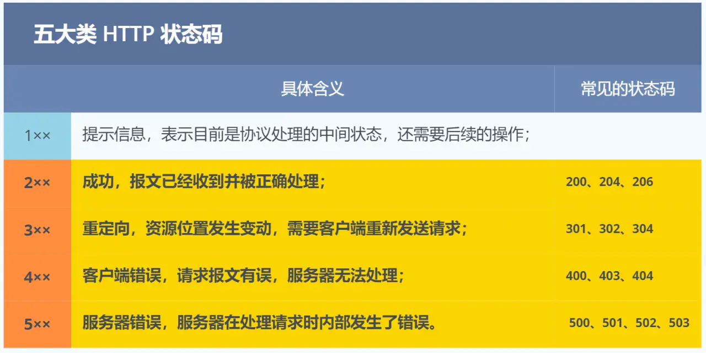
- 「200 OK」是成功状态码
- 「204 No Content」与200基本相同，但响应头无body数据
- 「206 Partial Content」是应用于 HTTP 分块下载或断点续传，表示响应返回的 body 数据并不是资源的全部，而是其中的一部分，也是服务器处理成功的状态。
- 「301 Moved Permanently」表示永久重定向，说明请求的资源已经不存在了，需改用新的 URL 再次访问。
- 「302 Found」表示临时重定向，说明请求的资源还在，但暂时需要用另一个 URL 来访问。
301和302都在响应头里使用字段Location，指明后续要跳转的URL，浏览器会自动重定向新的URL
- 「304 Not Modified」不具有跳转的含义，表示资源未修改，重定向已存在的缓冲文件，也称缓存重定向，也就是告诉客户端可以继续使用缓存资源，用于缓存控制。
- 「400 Bad Request」表示客户端请求的报文有错误，但只是个笼统的错误。
- 「403 Forbidden」表示服务器禁止访问资源，并不是客户端的请求出错。
- 「404 Not Found」表示请求的资源在服务器上不存在或未找到，所以无法提供给客户端。
- 「500 Internal Server Error」与 400 类型，是个笼统通用的错误码，服务器发生了什么错误，我们并不知道。
- 「501 Not Implemented」表示客户端请求的功能还不支持，类似“即将开业，敬请期待”的意思。
- 「502 Bad Gateway」通常是服务器作为网关或代理时返回的错误码，表示服务器自身工作正常，访问后端服务器发生了错误。
- 「503 Service Unavailable」表示服务器当前很忙，暂时无法响应客户端，类似“网络服务正忙，请稍后重试”的意思。

 HTTP 常见的字段有哪些？
 

Host字段

客户端发送请求时，用来指定服务器的域名， Host: www.A.com

Content-Length 字段

服务器在返回数据时，会有 Content-Length 字段，表明本次回应的数据长度。

Connection 字段

Connection 字段最常用于客户端要求服务器使用「HTTP 长连接」机制，以便其他请求复用。长连接的特点是只要任意一端没有明确提出断开连接，则保持TCP连接状态。 Connection: Keep-Alive

Content-Type 字段

Content-Type 字段用于服务器回应时，告诉客户端，本次数据是什么格式。
Content-Type: text/html; Charset=utf-8，表明发送的是网页，编码是UTF-8
客户端请求的时候，可以使用 Accept 字段声明自己可以接受哪些数据格式。
Accept: \*/\* 客户端可以接受任何格式的数据

Content-Encoding 字段

Content-Encoding 字段说明数据的压缩方法。表示服务器返回的数据使用了什么压缩格式
Content-Encoding: gzip 表示服务器返回的数据采用了gzip方式压缩
Accept-Encoding: gzip, deflate 表示客户端可以接受哪些压缩方法

#### GET与POST

 GET与POST有什么区别？
 

GET的语义是从服务器获得指定的资源，GET的请求一般是写在URL中，而URL只支持ASCII字符，所以GET也只支持ASCII字符

POST的语义是根据请求负荷(报文body)对指定的资源做出处理，它携带的数据的位置一般是写在报文body中，body中的数据可以是任意的格式，只要客户端和服务端协商好

 GET与POST都是安全和幂灯的吗？
 

* 安全： 请求方法不破坏服务器上的资源
* 幂等： 多次执行相同的操作，结果都是一样的

GET方法是「安全」和「幂等」的，它是只读操作，无论操作多少次，服务器上的数据都是安全的，且每次的结果都是相同的。而且可以对GET请求的数据进行缓存，这个缓存可以做到浏览器上（避免浏览器发送请求），也可以做到代理上（如nginx)

POST方法是「新增或提交数据」操作，会修改服务器上的资源，所以是「不安全」的，且多次提交数据就会创建多个资源，所以不是「幂等」的，所以浏览器不会缓存POST请求

但上面是从RFC规范定义的语义来分析的，实际过程中，开发者不一定要按规范的语义来实现GET和POST方法，也可以用GET来增加或删除数据，用POST来查询数据

如果「安全」的概念是指信息是否会被泄漏，那么因为HTTP传输的内容都是明文的，即使浏览器地址看不到POST请求提交的body数据，抓个包也能看到，所以都是「不安全」的，为了避免传输过程中数据被窃取，就要使用HTTPS协议  

#### HTTP缓存技术

 HTTP缓存有哪些实现方式？
 

对于具有重复性的HTTP请求，比如每次得到的数据都是一样的，我们就把这对「请求-响应」数据都缓存在本地，下次直接读取本地的数据，不用通过网络获取服务器的响应了

HTTP的缓存有两种实现方式：1. 强制缓存 2. 协商缓存

1. 强制缓存
浏览器判断缓存没有过期，则直接使用浏览器的本地缓存，决定是否使用缓存主动权在浏览器
强制缓存是在HTTP响应头部字段实现的，它们都用来表示资源在客户端缓存的有效期：
* Cache-Control 相对时间
* Expires 绝对时间

一般使用Cache-Control来实现强缓存，它优先级也更高

2. 协商缓存

通过服务器告知客户端是否可以使用缓存的方式被称为协商缓存，就是与服务器协商后通过协商结果来判断是否使用本地缓存

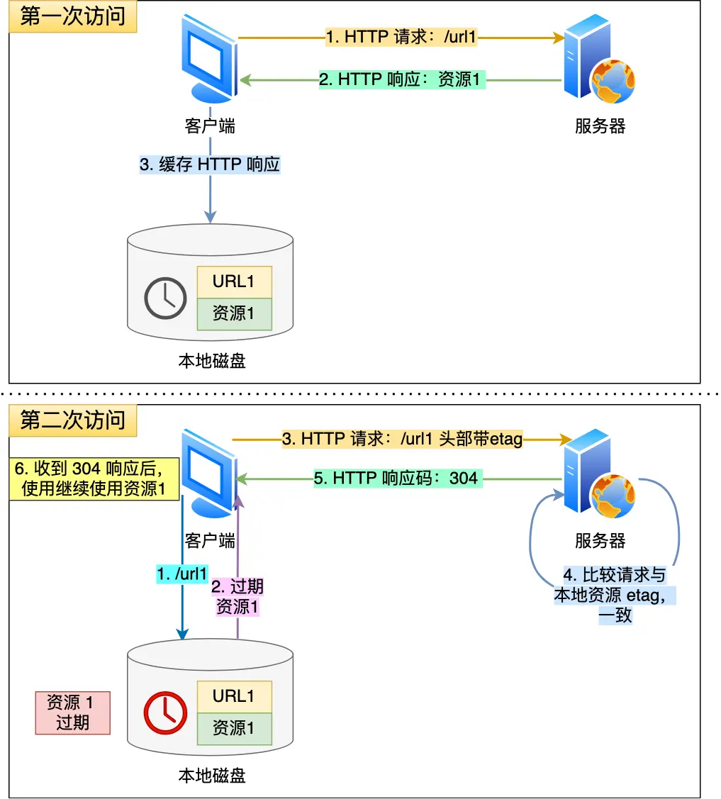

协商缓存的实现（2种）：
1. 请求头部的If-Modified-Since 字段与响应头部中的 Last-Modified 字段
响应头部中的 Last-Modified：标示这个响应资源的最后修改时间；
请求头部的If-Modified-Since：发现资源过期后，把上次接受的Last-Modified的时间带上发给服务器，服务器收到请求后发现有 If-Modified-Since 则与被请求资源的最后修改时间进行对比，如果改过就返回最新资源，没改就响应HTTP 304走缓存

2. 请求头部中的 If-None-Match 字段与响应头部中的 ETag 字段
响应头部中 Etag：唯一标识响应资源
请求头部中的 If-None-Match：当资源过期时，浏览器发现响应头里有 Etag，则再次向服务器发起请求时，会将请求头 If-None-Match 值设置为 Etag 的值。服务器收到请求后进行比对，如果资源没有变化返回 304，如果资源变化了返回 200。

第一种实现方式是基于时间修改的，第二种实现方式是基于一个唯一标识实现的，后者相对来说可以更准确的判断文件内容是否被修改

**协商缓存这两个字段都需要配合强制缓存中Cache-Control字段来使用，只有在未能命中强制缓存的时候，才能发起带有协商缓存字段的请求**
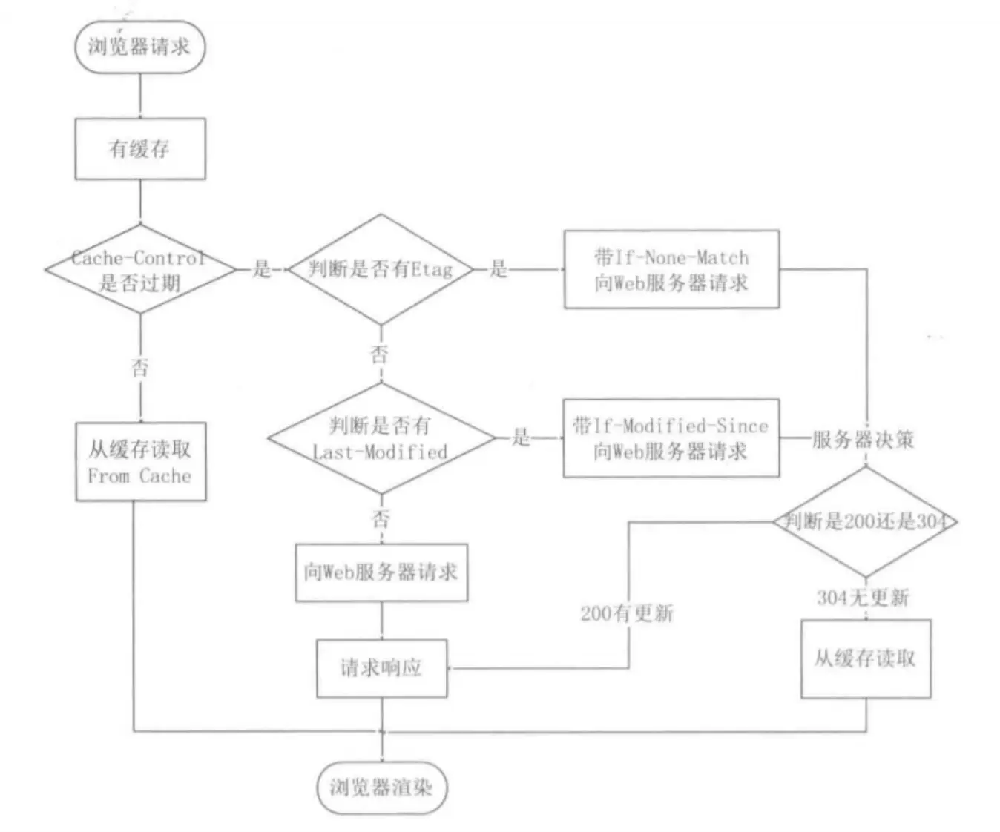

#### HTTP特性

 HTTP1.1
 

优点：
1. 简单
HTTP基本的报文格式是header + body，头部信息也是key-value的简单文本形式
2. 灵活
HTTP协议里的各类请求方法、URL、状态码、头字段等每个组成都允许开发者自定义和补充，而且由于HTTP工作在应用层，它的下层可以变化：
* HTTPS是HTTP与TCP层之间增加了SSL/TLS安全传输层
* HTTP/1.1和HTTP2.0传输协议使用的是TCP协议，而HTTP/3.0使用的是UDP协议

3. 应用广泛和跨平台
从台式机的浏览器到手机上的APP，HTTP的应用非常广泛

缺点：
1. 无状态

    服务器不记录HTTP的状态，这能减轻服务器负担，但在某些操作具有关联性时会很麻烦，比如例如登录->添加购物车->下单->结算->支付，这系列操作都要知道用户的身份才行。但服务器不知道这些请求是有关联的，每次都要问一遍身份信息。
对于这个问题，比较简单的解决方式是Cookie技术，它通过在请求和响应报文中写入Cookie信息来控制客户端的状态
2. 明文传输

    在传输的过程中，信息是可阅读的，方便调试，用Wireshark 抓包都可以直接肉眼查看，但相当于信息裸奔
3. 不安全

    * 使用明文通信，内容可能被窃听
    * 不验证通信方的身份，有可能遭遇伪装
    * 无法证明报文完整性，有可能被篡改

 HTTP1.1性能如何？
 

1. 长连接

早期HTTP/1.0的性能上一个很大的问题是，每发起一个请求都要建立一次TCP连接，而且是串行请求，增加了通信开销。
为了解决这个问题，HTTP/1.1提出了**长连接**的通信方式，只要任意一端没有明确提出断开连接，则保持TCP连接状态，
不过如果某个 HTTP 长连接超过一定时间没有任何数据交互，服务端就会主动断开这个连接。

